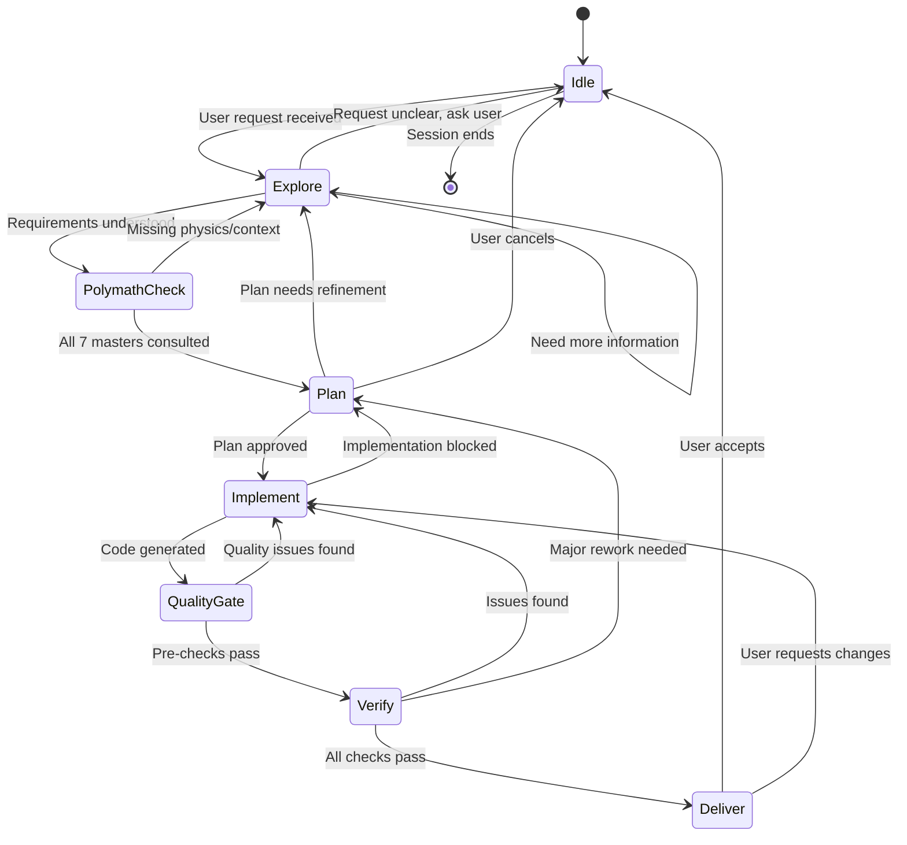
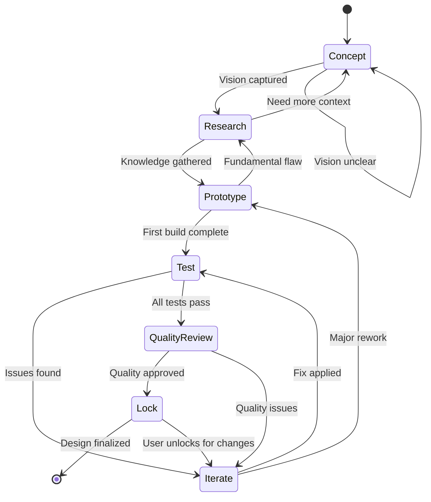

# STATE MACHINE DIAGRAMS v2.0
## Comprehensive Flow Documentation for Cutting-Edge Kinetic Design

---

> **This document defines all state machines governing agent behavior, design process, mechanism operation, quality assurance, and the complete hook/trigger/skill ecosystem.**

---

## TABLE OF CONTENTS

1. [Agent Workflow States](#1-agent-workflow-states)
2. [Design Process States](#2-design-process-states)
3. [Polymath Design Cycle](#3-polymath-design-cycle) **NEW**
4. [Quality Assurance States](#4-quality-assurance-states) **NEW**
5. [Mechanism Physical States](#5-mechanism-physical-states)
6. [Hook/Trigger Flow States](#6-hooktrigger-flow-states)
7. [Version Control States](#7-version-control-states)
8. [File Modification States](#8-file-modification-states)
9. [Skill Execution States](#9-skill-execution-states) **NEW**
10. [Sub-Agent Orchestration](#10-sub-agent-orchestration) **NEW**
11. [Longevity & Maintenance States](#11-longevity--maintenance-states) **NEW**

---

## 1. AGENT WORKFLOW STATES

### Mermaid Diagram



### ASCII Diagram

```
+========================================================================+
|                      AGENT WORKFLOW STATES v2.0                         |
+========================================================================+

                            Session ends
    +--------+                  ^
    |  IDLE  |<-----------------+----------------------------------+
    +---+----+                  |                                  |
        |                       |                                  |
        | User request          |                                  |
        v                       |                                  |
    +---------+   Need info   +---------+                          |
    | EXPLORE |<------------->| EXPLORE |                          |
    +----+----+               +---------+                          |
         |                                                         |
         | Requirements clear                                      |
         v                                                         |
    +----------------+                                             |
    | POLYMATH_CHECK |<--- NEW: Consult 7 Masters Framework        |
    +-------+--------+                                             |
            |                                                      |
            | All masters consulted                                |
            v                                                      |
    +--------+    Refinement needed                                |
    |  PLAN  |<------------------+                                 |
    +---+----+                   |                                 |
        |                        |                                 |
        | Plan approved          |                                 |
        v                        |                                 |
  +-----------+                  |                                 |
  | IMPLEMENT |------------------+                                 |
  +-----+-----+    Implementation blocked                          |
        |                                                          |
        | Code generated                                           |
        v                                                          |
  +--------------+                                                 |
  | QUALITY_GATE |<--- NEW: Pre-delivery quality checkpoint        |
  +------+-------+                                                 |
         |                                                         |
         | Pre-checks pass                                         |
         v                                                         |
    +--------+    Issues found     +-----------+                   |
    | VERIFY |<------------------->| IMPLEMENT |                   |
    +---+----+                     +-----------+                   |
        |                                                          |
        | All checks pass                                          |
        v                                                          |
    +---------+    User requests changes                           |
    | DELIVER |----------------------------------------------------+
    +---------+
        |
        | User accepts
        v
      [END]
```

### State Descriptions

| State | Entry Condition | Exit Conditions | Key Actions |
|-------|-----------------|-----------------|-------------|
| **IDLE** | Session start or delivery complete | User request received | Wait for input, ready for commands |
| **EXPLORE** | Request received | Requirements understood OR need clarification | Read files, analyze code, ask questions |
| **POLYMATH_CHECK** | Requirements clear | All 7 masters consulted | Apply Van Gogh (turbulence), Da Vinci (friction), Tesla (simulation), Edison (experimentation), Watt (efficiency), Galileo (measurement), Archimedes (first principles) |
| **PLAN** | Polymath check complete | Plan approved OR needs refinement | Design approach, identify dependencies, assess scope |
| **IMPLEMENT** | Plan approved | Code generated OR blocked | Write code, apply edits, run survival checks |
| **QUALITY_GATE** | Code generated | Pre-checks pass OR issues found | Perceived quality check, theatrical review, scale validation |
| **VERIFY** | Quality gate passed | Checks pass OR issues found | Component survival, version diff, z-stack, animation validation |
| **DELIVER** | All checks pass | User accepts OR requests changes | Present results, document changes |

---

## 2. DESIGN PROCESS STATES

### Mermaid Diagram



### State Descriptions

| State | Key Activities | Artifacts Produced | Exit Criteria |
|-------|---------------|-------------------|---------------|
| **CONCEPT** | Vision gathering, requirements capture | Master Specification document | Clear vision, all questions answered |
| **RESEARCH** | Consult Compendium, study masters, review patterns | Research notes, mechanism selection | Approach chosen with evidence |
| **PROTOTYPE** | First implementation, rough geometry, proof of concept | Initial .scad file | Mechanism renders, basic motion works |
| **TEST** | Component survival, z-stack check, animation test | Test reports, measurements | All tests pass OR issues documented |
| **QUALITY_REVIEW** | Perceived quality, theatrical check, professional finish | Quality assessment | Meets professional standards |
| **ITERATE** | Fix issues, refine parameters, optimize | Version delta, updated code | Issues resolved |
| **LOCK** | Finalize, add LOCKED comments, backup | Locked version, backup copy | User approval, no further changes |

---

## 3. POLYMATH DESIGN CYCLE (NEW)

### The Seven Masters Integration

```
+========================================================================+
|                    POLYMATH DESIGN CYCLE                                |
|              Applied Engineering Methodology                            |
+========================================================================+

    USER REQUEST
         |
         v
    +-------------+
    | VAN GOGH    |---> Is the motion mathematically encoded?
    | Turbulence  |     - Power-law speed relationships?
    +------+------+     - Cross-contour motion paths?
           |
           v
    +-------------+
    | DA VINCI    |---> Is friction calculated?
    | Friction    |     - Rolling vs sliding identified?
    +------+------+     - Cam sequences for complex motion?
           |
           v
    +-------------+
    | TESLA       |---> Can you mentally simulate full cycle?
    | Simulation  |     - Material limits considered?
    +------+------+     - Scaling effects anticipated?
           |
           v
    +-------------+
    | EDISON      |---> Physics constraints established first?
    | Experiment  |     - Parallel experiments possible?
    +------+------+     - Every attempt documented?
           |
           v
    +-------------+
    | WATT        |---> Where is energy/motion lost?
    | Efficiency  |     - One dominant improvement identified?
    +------+------+     - Feedback loop designed?
           |
           v
    +-------------+
    | GALILEO     |---> Tested at extremes?
    | Measurement |     - Measurements repeated?
    +------+------+     - Confirmation bias checked?
           |
           v
    +-------------+
    | ARCHIMEDES  |---> Traced torque from input to output?
    | First Princ.|     - Centers of gravity calculated?
    +------+------+     - Built from undeniable axioms?
           |
           v
    POLYMATH-VALIDATED DESIGN
```

### Polymath Checklist State

```
POLYMATH_CHECK state executes this checklist:

[ ] VAN GOGH CHECK
    - Motion encoded with mathematical relationships (not arbitrary)
    - Turbulence/flow patterns follow power laws where appropriate

[ ] DA VINCI CHECK
    - Friction coefficient estimated (μ ≈ 0.25 typical)
    - Rolling contact preferred over sliding
    - Force paths traced through mechanism

[ ] TESLA CHECK
    - Full cycle mentally simulated
    - Material limits noted for later verification
    - Scaling concerns identified

[ ] EDISON CHECK
    - Physics constraints defined BEFORE mechanism selection
    - Lessons from similar attempts documented
    - Parallel approaches considered

[ ] WATT CHECK
    - Energy loss points identified
    - Single most impactful improvement targeted
    - Feedback mechanism designed if applicable

[ ] GALILEO CHECK
    - Will be tested at extreme positions (not just nominal)
    - Measurements will be repeated
    - Seeking disconfirmation, not just confirmation

[ ] ARCHIMEDES CHECK
    - Torque chain traced: motor → gearbox → mechanism → output
    - Center of gravity calculated or estimated
    - Design built from first principles

ALL CHECKS PASS → Proceed to PLAN
ANY CHECK FAILS → Return to EXPLORE with specific gap identified
```

---

## 4. QUALITY ASSURANCE STATES (NEW)

### Quality Gate Flow

```
+========================================================================+
|                    QUALITY ASSURANCE STATES                             |
|         Applied from KINETIC_SCULPTURE_COMPENDIUM                       |
+========================================================================+

    CODE GENERATED
         |
         v
    +------------------+
    | PERCEIVED_QUALITY|---> 3-second expert assessment
    | Domain 14        |     - Finish quality?
    +--------+---------+     - Alignment precision?
             |               - Motion smoothness?
             |
    +--------v---------+
    | THEATRICAL_CHECK |---> Viewing experience design
    | Domain 12        |     - Optimal viewing distance?
    +--------+---------+     - Lighting considered?
             |               - Discovery moments?
             |
    +--------v---------+
    | SCALE_VALIDATION |---> Scale-specific checks
    | Domain 13        |     - Desktop tolerances (0.3mm)?
    +--------+---------+     - Motor selection appropriate?
             |               - Bearing solution valid?
             |
    +--------v---------+
    | ASSEMBLY_PREVIEW |---> Assembly feasibility
    | Domain 11        |     - Sequence possible?
    +--------+---------+     - Adjustment points exist?
             |               - Points of no return identified?
             |
    +--------v---------+
    | LONGEVITY_CHECK  |---> Long-term viability
    | Domain 10        |     - Wear surfaces identified?
    +--------+---------+     - Lubrication strategy?
             |               - Maintenance access?
             v
    QUALITY_GATE_PASSED → VERIFY
         or
    QUALITY_ISSUES → IMPLEMENT (with specific fixes)
```

### Quality Gate Checklist

```
QUALITY_GATE state executes:

PERCEIVED QUALITY (3-second test):
[ ] Edges chamfered/rounded (no sharp corners)
[ ] Surfaces smooth (sanded to 400+ for visible)
[ ] Fasteners consistent (same type, aligned)
[ ] Motion smooth (no stutter or jerk)
[ ] Sound acceptable (no grinding or clicking)

THEATRICAL CHECK:
[ ] Viewing distance defined (desktop: 30-100cm)
[ ] Foreground/background motion layered
[ ] Cycle time appropriate (30-90 seconds ideal)
[ ] Discovery moments designed for repeat viewing

SCALE VALIDATION:
[ ] Wall thickness ≥ 1.2mm everywhere
[ ] Moving clearances ≥ 0.3mm
[ ] Gear module appropriate (0.5-1.5 for desktop)
[ ] Motor torque ≥ 3× calculated load

ASSEMBLY PREVIEW:
[ ] Assembly sequence documented (inside-out, core first)
[ ] Adjustment points exist (slotted holes, eccentric mounts)
[ ] No trapped components (point of no return identified)

LONGEVITY CHECK:
[ ] High-wear surfaces identified
[ ] Lubrication strategy defined (PTFE, oil, grease)
[ ] Maintenance access designed
[ ] 10,000 cycle lifespan achievable
```

---

## 5. MECHANISM PHYSICAL STATES

### ASCII Diagram

```
+========================================================================+
|                   MECHANISM PHYSICAL STATES                             |
|           (For the actual kinetic automaton, not software)              |
+========================================================================+

                         +-------------+
                    +--->| MAINTENANCE |
                    |    +------+------+
                    | Requires  |
                    | intervention
                    |           | Repair complete
       +-------+    |           v
       | ERROR |----+    +------+
       +---+---+         | IDLE |<--------------------------+
           ^             +--+---+                           |
           | Jam/collision  |                               |
           |                | Motor on                      |
           |                v                               |
           |         +---------+                            |
           +---------| RUNNING |----------------------------+
                     +----+----+    Motor off
                          |
                          | User pause
                          v
                     +--------+
                     | PAUSED |
                     +---+----+
                         |
            +------------+------------+
            |                         |
            | User resume             | User stop
            v                         v
       +---------+               +------+
       | RUNNING |               | IDLE |
       +---------+               +------+
```

### Error Codes (Extended)

```
OPERATIONAL ERRORS:
E001: Motor stall detected
E002: Position sensor mismatch
E003: Overtemperature warning
E004: Power supply fault
E005: Emergency stop triggered

MECHANISM ERRORS (NEW):
E101: Dead point lockup - crank + coupler collinear
E102: Transmission angle critical (<40° or >140°)
E103: Coupler length violation - mechanism stretching
E104: Gear mesh failure - teeth skipping
E105: Bearing seizure - friction spike detected

QUALITY ERRORS (NEW):
E201: Motion jerk detected - acceleration discontinuity
E202: Backlash excessive - >0.5mm play detected
E203: Resonance detected - vibration at natural frequency
E204: Sound threshold exceeded - grinding/clicking detected
E205: Position drift - mechanism not returning to zero
```

---

## 6. HOOK/TRIGGER FLOW STATES

### Expanded Hook System

```
+========================================================================+
|                    HOOK/TRIGGER FLOW STATES v2.0                        |
|                     15 Hooks, 4 Priority Levels                         |
+========================================================================+

    +------------+
    | MONITORING |<-----------------------------------------+
    +-----+------+                                          |
          |                                                 |
          | Pattern matched                                 |
          v                                                 |
    +------------------+                                    |
    | TRIGGER_DETECTED |                                    |
    +--------+---------+                                    |
             |                                              |
             | Determine priority                           |
             v                                              |
    +----------------+                                      |
    | PRIORITY_CHECK |                                      |
    +-------+--------+                                      |
            |                                               |
    +-------+-------+-------+-------+                       |
    |       |       |       |       |                       |
    v       v       v       v       v                       |
  P1:CRIT P2:SAFE P3:VERIFY P4:UX  P5:ENHANCE              |
    |       |       |       |       |                       |
    +-------+-------+-------+-------+                       |
            |                                               |
            v                                               |
    +----------------+                                      |
    | ACTION_PENDING |                                      |
    +-------+--------+                                      |
            |                                               |
    +-------+-------+                                       |
    |               |                                       |
    v               v                                       |
 CONFIRM?        AUTO_EXECUTE                               |
    |               |                                       |
    v               v                                       |
+-----------+ +-----------+                                 |
| EXECUTING | | EXECUTING |                                 |
+-----+-----+ +-----+-----+                                 |
      |             |                                       |
      +------+------+                                       |
             |                                              |
      +------+------+                                       |
      |             |                                       |
      v             v                                       |
+-----------+ +---------+                                   |
| COMPLETED | | FAILED  |                                   |
+-----+-----+ +----+----+                                   |
      |            |                                        |
      +------------+----------------------------------------+
```

### Complete Hook Registry (15 Hooks)

```
PRIORITY 1: CRITICAL SAFETY (Block until resolved)
┌─────────────────────────────────────────────────────────────────┐
│ Hook 1: physical-linkage-check                                   │
│   Trigger: BEFORE any animation code generation                  │
│   Action: Verify coupler connections, motion types, Grashof      │
│   Mode: BLOCKING - must pass before proceeding                   │
├─────────────────────────────────────────────────────────────────┤
│ Hook 2: impossible-physics-detector                              │
│   Trigger: sin()/cos() in animation without connection trace     │
│   Action: Halt, report unphysical animation                      │
│   Mode: BLOCKING                                                 │
├─────────────────────────────────────────────────────────────────┤
│ Hook 3: scale-cube-law-check                                     │
│   Trigger: Any scaling operation (2×, 0.5×, etc.)                │
│   Action: Warn about mass³, strength², motor requirements        │
│   Mode: WARNING with required acknowledgment                     │
└─────────────────────────────────────────────────────────────────┘

PRIORITY 2: PRESERVATION (Protect work)
┌─────────────────────────────────────────────────────────────────┐
│ Hook 4: pre-code-generation                                      │
│   Trigger: Before any .scad file modification                    │
│   Action: Read existing, identify dependencies, check LOCKED     │
│   Mode: AUTO with scope declaration                              │
├─────────────────────────────────────────────────────────────────┤
│ Hook 5: lock-in-detector                                         │
│   Trigger: "lock", "freeze", "final", "approved"                 │
│   Action: Add LOCKED comments, create backup                     │
│   Mode: CONFIRM - user must approve lock                         │
├─────────────────────────────────────────────────────────────────┤
│ Hook 6: complexity-warning                                       │
│   Trigger: Changes affect >3 components/mechanisms               │
│   Action: List affected, suggest incremental approach            │
│   Mode: CONFIRM                                                  │
└─────────────────────────────────────────────────────────────────┘

PRIORITY 3: VERIFICATION (Quality gates)
┌─────────────────────────────────────────────────────────────────┐
│ Hook 7: post-version-delivery                                    │
│   Trigger: After creating new version file                       │
│   Action: Component survival, diff summary, test prompt          │
│   Mode: AUTO                                                     │
├─────────────────────────────────────────────────────────────────┤
│ Hook 8: polymath-pre-design-check                                │
│   Trigger: New mechanism request detected                        │
│   Action: Execute 7 masters checklist                            │
│   Mode: AUTO with checklist output                               │
├─────────────────────────────────────────────────────────────────┤
│ Hook 9: perceived-quality-gate                                   │
│   Trigger: Before delivery of any design                         │
│   Action: 3-second assessment, finish check, motion quality      │
│   Mode: AUTO with recommendations                                │
├─────────────────────────────────────────────────────────────────┤
│ Hook 10: animation-frame-validator                               │
│   Trigger: After animation code written                          │
│   Action: Test at $t = 0, 0.25, 0.5, 0.75, 1.0                   │
│   Mode: AUTO - report any collisions or violations               │
└─────────────────────────────────────────────────────────────────┘

PRIORITY 4: USER EXPERIENCE (Support and guidance)
┌─────────────────────────────────────────────────────────────────┐
│ Hook 11: user-frustration-detector                               │
│   Trigger: "ugh", "argh", "damn", "wrong again", etc.            │
│   Action: Pause, acknowledge, summarize attempts, new approach   │
│   Mode: AUTO with empathy                                        │
├─────────────────────────────────────────────────────────────────┤
│ Hook 12: physical-reality-check                                  │
│   Trigger: "will this work?", "can this move?", etc.             │
│   Action: Check clearances, mesh, printability, balance          │
│   Mode: AUTO with detailed report                                │
├─────────────────────────────────────────────────────────────────┤
│ Hook 13: failure-pattern-detector                                │
│   Trigger: Known failure pattern phrases detected                │
│   Action: Reference FAILURE_PATTERNS.md, suggest prevention      │
│   Mode: WARNING                                                  │
└─────────────────────────────────────────────────────────────────┘

PRIORITY 5: ENHANCEMENT (Optional improvements)
┌─────────────────────────────────────────────────────────────────┐
│ Hook 14: theatrical-suggestion                                   │
│   Trigger: Design nearing completion                             │
│   Action: Suggest lighting, viewing angle, discovery moments     │
│   Mode: SUGGESTION (non-blocking)                                │
├─────────────────────────────────────────────────────────────────┤
│ Hook 15: longevity-advisor                                       │
│   Trigger: Mechanism complete, before lock                       │
│   Action: Suggest wear mitigation, maintenance access            │
│   Mode: SUGGESTION                                               │
└─────────────────────────────────────────────────────────────────┘
```

### Hook Priority Resolution

```
When multiple hooks trigger simultaneously:

RESOLUTION ORDER:
1. All P1:CRITICAL must resolve first (blocking)
2. P2:PRESERVATION evaluated next
3. P3:VERIFICATION runs in parallel where possible
4. P4:UX interleaved with output
5. P5:ENHANCEMENT appended as suggestions

CONFLICT RESOLUTION:
- If P1 blocks, all other hooks queue
- If P2 suggests rollback, P3+ hooks skip
- P4+P5 never block core workflow
```

---

## 7. VERSION CONTROL STATES

### ASCII Diagram

```
+========================================================================+
|                    VERSION CONTROL STATES                               |
+========================================================================+

    +--------+
    | STABLE |<-----------------------------------------------------+
    +---+----+                                                      |
        |                                                           |
        | Change requested                                          |
        v                                                           |
    +----------+                                                    |
    | MODIFIED |                                                    |
    +----+-----+                                                    |
         |                                                          |
         | Version diff run                                         |
         v                                                          |
    +------------+    Only intended changes    +---------+          |
    | VALIDATING |----------------------------->| STAGING |         |
    +-----+------+                             +----+----+          |
          |                                         |               |
          | Unexpected changes found                |               |
          v                                         |               |
    +----------+                                    |               |
    | ROLLBACK |                                    |               |
    +----+-----+                                    |               |
         |                                          |               |
         | Restored to previous state               |               |
         +----------------------------------------->+               |
                                                    |               |
                                                    v               |
                                              +----------+          |
                                              | COMMITTED|----------+
                                              +----------+  Tests pass
```

---

## 8. FILE MODIFICATION STATES

### ASCII Diagram

```
+========================================================================+
|                    FILE MODIFICATION STATES                             |
+========================================================================+

    +----------+
    | PRISTINE |<----- File unchanged since last commit
    +----+-----+
         |
         | Read file
         v
    +--------+
    | LOADED |<----- File in memory, analyzing
    +---+----+
        |
        | pre-code-generation hook triggered
        v
    +----------------+
    | CHANGE_PENDING |<----- Changes planned, awaiting confirmation
    +-------+--------+
            |
            | User confirms
            v
    +----------+
    | MODIFIED |<----- Changes applied to file
    +----+-----+
         |
         | post-version-delivery hook
         v
    +----------+
    | VERIFIED |<----- Component survival passed
    +----+-----+
         |
         | Saved to disk
         v
    +-------+
    | SAVED |<----- File on disk, ready for commit
    +-------+
```

---

## 9. SKILL EXECUTION STATES (NEW)

### Skill Invocation Flow

```
+========================================================================+
|                    SKILL EXECUTION STATES                               |
|                    12 Skills, 4 Categories                              |
+========================================================================+

    USER COMMAND: /skill-name [args]
         |
         v
    +-------------+
    | SKILL_PARSE |---> Identify skill, validate arguments
    +------+------+
           |
           | Valid skill identified
           v
    +---------------+
    | CONTEXT_GATHER|---> Read required files, gather state
    +-------+-------+
            |
            | Context ready
            v
    +---------------+
    | SKILL_EXECUTE |---> Run skill-specific logic
    +-------+-------+
            |
            +--------+--------+
            |                 |
            v                 v
    +--------------+   +--------------+
    | SKILL_OUTPUT |   | SKILL_ERROR  |
    +------+-------+   +------+-------+
           |                  |
           | Format results   | Handle gracefully
           v                  v
    +---------------+   +--------------+
    | PRESENT_USER  |   | OFFER_HELP   |
    +---------------+   +--------------+
```

### Complete Skill Registry (12 Skills)

```
CATEGORY 1: CALCULATION SKILLS
┌─────────────────────────────────────────────────────────────────┐
│ /gear-calc [teeth1] [teeth2] [module]                           │
│   Purpose: Calculate gear parameters for meshing                 │
│   Outputs: Pitch diameters, center distance, contact ratio       │
│   Formulas: PD = m × T, CD = m × (T1+T2) / 2                    │
├─────────────────────────────────────────────────────────────────┤
│ /linkage-check [mechanism_file]                                  │
│   Purpose: Analyze linkage geometry and motion range             │
│   Outputs: DOF, Grashof condition, transmission angles           │
│   Checks: Dead points, motion limits                             │
├─────────────────────────────────────────────────────────────────┤
│ /torque-chain [mechanism_file]                 NEW               │
│   Purpose: Trace torque from motor to output                     │
│   Outputs: Torque at each stage, efficiency estimate             │
│   Validates: Motor capacity > mechanism load                     │
├─────────────────────────────────────────────────────────────────┤
│ /balance-check [mechanism_file]                NEW               │
│   Purpose: Calculate center of gravity analysis                  │
│   Outputs: CG position, stability assessment, counterweight      │
│   Checks: CG shift during motion, tipping risk                   │
└─────────────────────────────────────────────────────────────────┘

CATEGORY 2: VERIFICATION SKILLS
┌─────────────────────────────────────────────────────────────────┐
│ /component-survival [scad_file]                                  │
│   Purpose: Verify all components still function after changes    │
│   Checks: Module compilation, parameters, dependencies           │
│   Outputs: Survival report, missing components                   │
├─────────────────────────────────────────────────────────────────┤
│ /version-diff [v_old] [v_new]                                    │
│   Purpose: Compare two versions and summarize changes            │
│   Outputs: Parameter changes, added/removed modules              │
│   Warns: Breaking changes, unexpected modifications              │
├─────────────────────────────────────────────────────────────────┤
│ /z-stack [mechanism_file]                                        │
│   Purpose: Analyze vertical layer stacking for assembly          │
│   Outputs: Layer order, clearance verification, fastener lengths │
│   Recommends: Assembly sequence                                  │
├─────────────────────────────────────────────────────────────────┤
│ /animation-test [scad_file]                    NEW               │
│   Purpose: Validate animation at multiple $t positions           │
│   Tests: $t = 0, 0.25, 0.5, 0.75, 1.0                           │
│   Checks: Collisions, coupler stretch, impossible positions      │
└─────────────────────────────────────────────────────────────────┘

CATEGORY 3: EXPORT SKILLS
┌─────────────────────────────────────────────────────────────────┐
│ /svg-extract [scad_file] [layer_height]                          │
│   Purpose: Extract 2D profiles for laser cutting                 │
│   Outputs: Separated layer SVGs                                  │
│   Includes: Kerf compensation recommendations                    │
├─────────────────────────────────────────────────────────────────┤
│ /bom-generate [scad_file]                      NEW               │
│   Purpose: Generate bill of materials                            │
│   Outputs: Parts list, quantities, materials, sources            │
│   Includes: Hardware, bearings, fasteners                        │
└─────────────────────────────────────────────────────────────────┘

CATEGORY 4: QUALITY SKILLS
┌─────────────────────────────────────────────────────────────────┐
│ /quality-audit [scad_file]                     NEW               │
│   Purpose: Run full quality assessment                           │
│   Checks: Perceived quality, theatrical, scale, assembly         │
│   Outputs: Quality score, specific improvements                  │
├─────────────────────────────────────────────────────────────────┤
│ /longevity-report [scad_file]                  NEW               │
│   Purpose: Assess long-term durability                           │
│   Identifies: Wear surfaces, failure points, maintenance needs   │
│   Recommends: Lubrication schedule, replacement parts            │
└─────────────────────────────────────────────────────────────────┘
```

---

## 10. SUB-AGENT ORCHESTRATION (NEW)

### Sub-Agent Architecture

```
+========================================================================+
|                    SUB-AGENT ORCHESTRATION                              |
|                    7 Specialized Domain Experts                         |
+========================================================================+

                        +------------------+
                        | ORCHESTRATOR     |
                        | (Main Agent)     |
                        +--------+---------+
                                 |
         +----------+------------+------------+----------+
         |          |            |            |          |
         v          v            v            v          v
    +---------+ +--------+ +----------+ +--------+ +----------+
    |MECHANISM| |OPENSCAD| |POLYMATH  | |QUALITY | |LONGEVITY |
    |ANALYST  | |ARCHITECT| |GUARDIAN | |AUDITOR | |ADVISOR   |
    +---------+ +--------+ +----------+ +--------+ +----------+
         |          |            |            |          |
         v          v            v            v          v
    Kinematics   Code      7 Masters     Domain 14   Domain 10
    Linkages     Syntax    Framework     Checks      Checks
    Physics      Modules   Validation    Finish      Wear
```

### Complete Sub-Agent Registry (7 Agents)

```
SUB-AGENT 1: MechanismAnalyst
┌─────────────────────────────────────────────────────────────────┐
│ Specialization: Kinematic analysis and mechanism design         │
│ Triggers: Four-bar, gear train, cam, linkage questions          │
│ Knowledge: PHYSICS_REFERENCE, MECHANISM_DECISION_TREE           │
│ Outputs: Grashof analysis, transmission angles, dead points     │
│ Skills: /linkage-check, /gear-calc, /torque-chain               │
└─────────────────────────────────────────────────────────────────┘

SUB-AGENT 2: OpenSCADArchitect
┌─────────────────────────────────────────────────────────────────┐
│ Specialization: OpenSCAD code generation and optimization       │
│ Triggers: Code writing, module design, parametric patterns      │
│ Knowledge: OpenSCAD syntax, component library, version control  │
│ Outputs: Clean, documented, parametric OpenSCAD code            │
│ Skills: /component-survival, /version-diff                      │
└─────────────────────────────────────────────────────────────────┘

SUB-AGENT 3: PolymathGuardian                    NEW
┌─────────────────────────────────────────────────────────────────┐
│ Specialization: Enforcing 7 Masters methodology                 │
│ Triggers: New mechanism design, significant changes             │
│ Knowledge: POLYMATH_LENS, FAILURE_PATTERNS                      │
│ Outputs: Polymath checklist results, methodology violations     │
│ Hooks: polymath-pre-design-check                                │
└─────────────────────────────────────────────────────────────────┘

SUB-AGENT 4: QualityAuditor                      NEW
┌─────────────────────────────────────────────────────────────────┐
│ Specialization: Perceived quality and professional finish       │
│ Triggers: Pre-delivery, quality questions, "is this good?"      │
│ Knowledge: Compendium Domain 14, Domain 12                      │
│ Outputs: Quality score, specific improvements, professional     │
│         vs amateur comparisons                                   │
│ Skills: /quality-audit                                          │
└─────────────────────────────────────────────────────────────────┘

SUB-AGENT 5: LongevityAdvisor                    NEW
┌─────────────────────────────────────────────────────────────────┐
│ Specialization: Long-term durability and maintenance            │
│ Triggers: Wear questions, "how long will this last?"            │
│ Knowledge: Compendium Domain 10, Domain 11                      │
│ Outputs: Wear predictions, maintenance schedules, replacement   │
│         part recommendations                                     │
│ Skills: /longevity-report                                       │
└─────────────────────────────────────────────────────────────────┘

SUB-AGENT 6: AssemblyPlanner                     NEW
┌─────────────────────────────────────────────────────────────────┐
│ Specialization: Assembly sequence and manufacturability         │
│ Triggers: Assembly questions, "how do I build this?"            │
│ Knowledge: Compendium Domain 11, Domain 3                       │
│ Outputs: Assembly sequence, tolerance stack analysis,           │
│         adjustment procedures, first-run protocols               │
│ Skills: /z-stack, /bom-generate                                 │
└─────────────────────────────────────────────────────────────────┘

SUB-AGENT 7: TheatricalDirector                  NEW
┌─────────────────────────────────────────────────────────────────┐
│ Specialization: Viewing experience and presentation             │
│ Triggers: Presentation questions, "how should this look?"       │
│ Knowledge: Compendium Domain 12, MOTION_AESTHETICS              │
│ Outputs: Viewing distance recommendations, lighting design,     │
│         discovery moment placement, layered motion composition   │
│ Hooks: theatrical-suggestion                                    │
└─────────────────────────────────────────────────────────────────┘
```

### Agent Orchestration Rules

```
DELEGATION RULES:

1. AUTOMATIC DELEGATION:
   - Mechanism questions → MechanismAnalyst
   - Code writing → OpenSCADArchitect
   - New designs → PolymathGuardian first
   - Pre-delivery → QualityAuditor

2. PARALLEL EXECUTION:
   - MechanismAnalyst + OpenSCADArchitect (analysis + code)
   - QualityAuditor + LongevityAdvisor (dual review)

3. SEQUENTIAL EXECUTION:
   - PolymathGuardian BEFORE any design work
   - QualityAuditor BEFORE delivery
   - LongevityAdvisor BEFORE lock

4. CONFLICT RESOLUTION:
   - PolymathGuardian can veto any design
   - QualityAuditor can request revisions
   - User can override with explicit acknowledgment
```

---

## 11. LONGEVITY & MAINTENANCE STATES (NEW)

### Mechanism Lifecycle States

```
+========================================================================+
|               LONGEVITY & MAINTENANCE STATES                            |
|           (Post-build lifecycle management)                             |
+========================================================================+

    +--------+
    | NEW    |<----- Fresh from fabrication
    +---+----+
        |
        | First run complete, break-in period
        v
    +------------+
    | BREAK_IN   |<----- First 100 cycles, monitoring
    +-----+------+
          |
          | Break-in complete, parameters stable
          v
    +----------+
    | NOMINAL  |<----- Normal operation (years)
    +----+-----+
         |
    +----+------------------------+
    |                             |
    | Scheduled maintenance       | Wear detected
    v                             v
+---------------+         +---------------+
| SCHEDULED_    |         | WEAR_WARNING  |
| MAINTENANCE   |         |               |
+-------+-------+         +-------+-------+
        |                         |
        | Complete                | Addressed
        v                         v
    +----------+             +----------+
    | NOMINAL  |             | NOMINAL  |
    +----------+             +----------+
         |
         | End of life indicators
         v
    +-----------+
    | END_OF_   |<----- Requires rebuild/replacement
    | LIFE      |
    +-----------+
```

### Maintenance Schedule Template

```
BREAK-IN PERIOD (First 100 cycles):
[ ] Monitor for unusual sounds
[ ] Check for binding at any position
[ ] Re-lubricate after cycle 50
[ ] Verify all fasteners tight at cycle 100

MONTHLY CHECKS:
[ ] Visual inspection for wear
[ ] Listen for changes in sound
[ ] Check for drift in zero position
[ ] Dust removal from exposed surfaces

QUARTERLY MAINTENANCE:
[ ] Full lubrication refresh
[ ] Fastener torque check
[ ] Gear mesh inspection
[ ] Bearing play check

ANNUAL OVERHAUL:
[ ] Complete disassembly and inspection
[ ] Replace wear surfaces as needed
[ ] Update lubrication
[ ] Full function test at all positions
[ ] Document condition and repairs
```

---

## CROSS-REFERENCE: COMPLETE STATE INTERACTION MAP

```
+========================================================================+
|                    COMPLETE STATE INTERACTION MAP                       |
+========================================================================+

User Request
     |
     v
[Agent: IDLE] ──────> [Agent: EXPLORE]
                           |
                           v
                    [Hook: polymath-pre-design-check]
                           |
                           v
                    [Agent: POLYMATH_CHECK]
                           |
                    [SubAgent: PolymathGuardian]
                           |
                           v
                    [Agent: PLAN]
                           |
                    [SubAgent: MechanismAnalyst]
                           |
                           v
                    [Agent: IMPLEMENT]
                           |
                    [SubAgent: OpenSCADArchitect]
                    [File: CHANGE_PENDING → MODIFIED]
                           |
                    [Hook: post-version-delivery]
                           |
                           v
                    [Agent: QUALITY_GATE]
                           |
                    [SubAgent: QualityAuditor]
                    [SubAgent: LongevityAdvisor]
                           |
                    [Hook: perceived-quality-gate]
                           |
                           v
                    [Agent: VERIFY]
                           |
                    [Skill: /component-survival]
                    [Skill: /animation-test]
                    [File: MODIFIED → VERIFIED]
                           |
                           v
                    [Agent: DELIVER]
                           |
                    [SubAgent: TheatricalDirector]
                    [Hook: theatrical-suggestion]
                    [File: VERIFIED → SAVED]
                           |
                           v
                    [Agent: IDLE]
```

---

## QUICK REFERENCE: STATE MACHINE SUMMARY

| Machine | States | Primary Purpose |
|---------|--------|-----------------|
| Agent Workflow | 8 | Manages AI agent behavior during session |
| Design Process | 7 | Tracks mechanical design lifecycle |
| Polymath Cycle | 7 | Enforces 7 masters methodology |
| Quality Assurance | 5 | Pre-delivery quality gates |
| Mechanism Physical | 5 | Represents actual automaton states |
| Hook/Trigger Flow | 7 | Controls automated behavior triggers |
| Version Control | 6 | Manages file version integrity |
| File Modification | 6 | Tracks individual file changes |
| Skill Execution | 5 | Manages slash command execution |
| Sub-Agent Orchestration | 7 | Coordinates specialized agents |
| Longevity & Maintenance | 6 | Post-build lifecycle management |

---

*Document Version: 2.0*
*Purpose: Comprehensive state documentation for cutting-edge kinetic design agent*
*Related Documents: KINETIC_SCULPTURE_COMPENDIUM.md, POLYMATH_LENS.md, skills.md, hooks.md, sub_agents.md*
