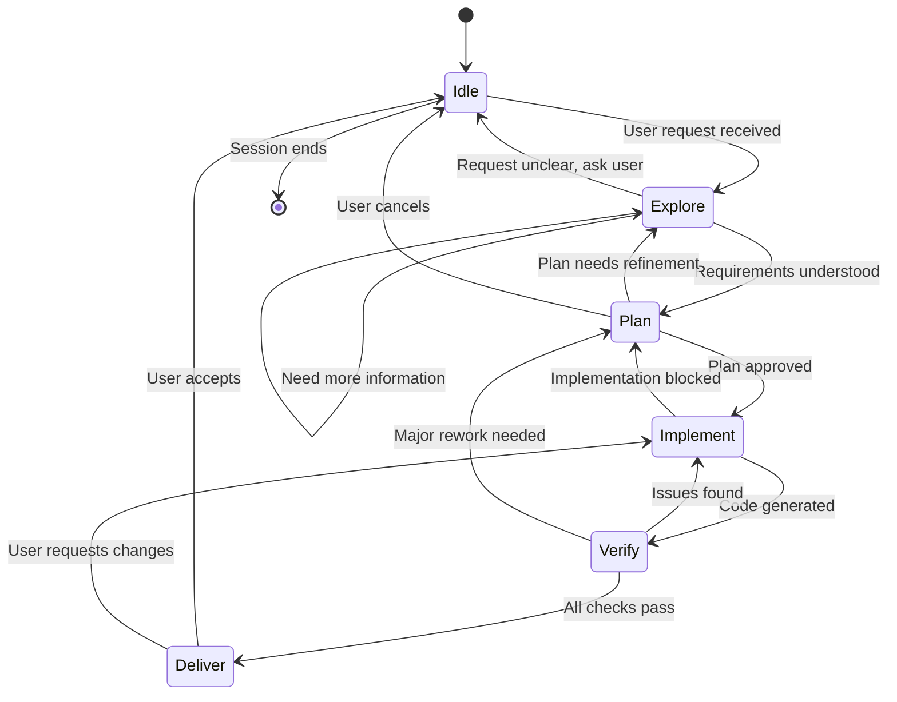
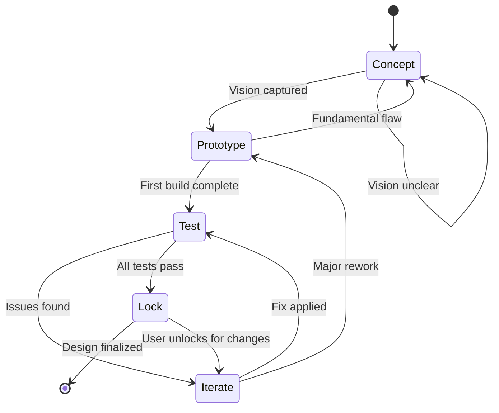
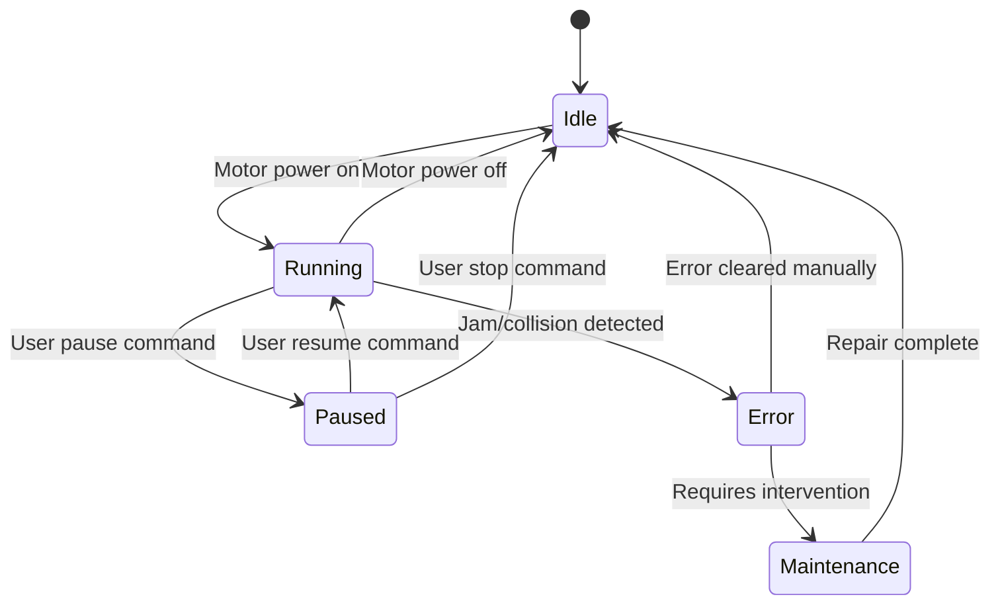
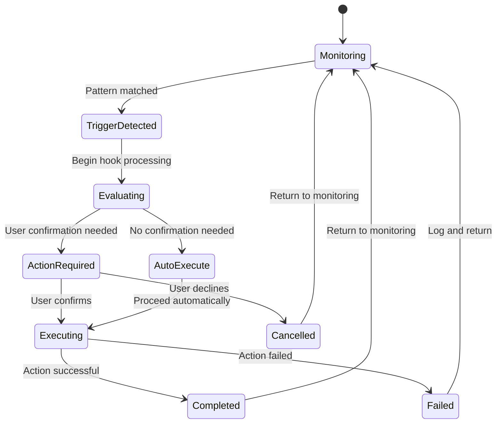

# STATE MACHINE DIAGRAMS
## Comprehensive Flow Documentation for 3D Mechanical Design

---

> **This document defines all state machines governing agent behavior, design process, mechanism operation, and hook/trigger flows.**

---

## TABLE OF CONTENTS

1. [Agent Workflow States](#1-agent-workflow-states)
2. [Design Process States](#2-design-process-states)
3. [Mechanism Physical States](#3-mechanism-physical-states)
4. [Hook/Trigger Flow States](#4-hooktrigger-flow-states)
5. [Version Control States](#5-version-control-states)
6. [File Modification States](#6-file-modification-states)

---

## 1. AGENT WORKFLOW STATES

### Mermaid Diagram



### ASCII Diagram

```
+======================================================================+
|                      AGENT WORKFLOW STATES                           |
+======================================================================+

                           Session ends
    +--------+                  ^
    |  IDLE  |<-----------------+----------------------------------+
    +---+----+                  |                                  |
        |                       |                                  |
        | User request          |                                  |
        v                       |                                  |
    +---------+   Need info   +---------+                          |
    | EXPLORE |<------------->| EXPLORE |                          |
    +----+----+               +---------+                          |
         |                                                         |
         | Requirements clear                                      |
         v                                                         |
    +--------+    Refinement needed                                |
    |  PLAN  |<------------------+                                 |
    +---+----+                   |                                 |
        |                        |                                 |
        | Plan approved          |                                 |
        v                        |                                 |
  +-----------+                  |                                 |
  | IMPLEMENT |------------------+                                 |
  +-----+-----+    Implementation blocked                          |
        |                                                          |
        | Code generated                                           |
        v                                                          |
    +--------+    Issues found     +-----------+                   |
    | VERIFY |<------------------->| IMPLEMENT |                   |
    +---+----+                     +-----------+                   |
        |                                                          |
        | All checks pass                                          |
        v                                                          |
    +---------+    User requests changes                           |
    | DELIVER |----------------------------------------------------+
    +---------+
        |
        | User accepts
        v
      [END]
```

### State Descriptions

| State | Entry Condition | Exit Conditions | Key Actions |
|-------|-----------------|-----------------|-------------|
| **IDLE** | Session start or delivery complete | User request received | Wait for input, ready for commands |
| **EXPLORE** | Request received | Requirements understood OR need clarification | Read files, analyze code, ask questions |
| **PLAN** | Requirements clear | Plan approved OR needs refinement | Design approach, identify dependencies, assess scope |
| **IMPLEMENT** | Plan approved | Code generated OR blocked | Write code, apply edits, run survival checks |
| **VERIFY** | Code generated | Checks pass OR issues found | Component survival, version diff, z-stack |
| **DELIVER** | All checks pass | User accepts OR requests changes | Present results, document changes |

### Transition Rules

```
IDLE -> EXPLORE:
  Trigger: User sends request
  Action: Read relevant files, gather context

EXPLORE -> PLAN:
  Trigger: Requirements fully understood
  Action: Design implementation approach

EXPLORE -> IDLE:
  Trigger: Cannot understand request
  Action: Ask clarifying questions

PLAN -> IMPLEMENT:
  Trigger: User approves plan
  Action: Begin code modifications

PLAN -> EXPLORE:
  Trigger: Plan reveals missing information
  Action: Gather additional context

IMPLEMENT -> VERIFY:
  Trigger: Code changes complete
  Action: Run verification checks

IMPLEMENT -> PLAN:
  Trigger: Implementation hits blocker
  Action: Revise approach

VERIFY -> DELIVER:
  Trigger: All checks pass
  Action: Present final result

VERIFY -> IMPLEMENT:
  Trigger: Issues found
  Action: Fix issues

DELIVER -> IDLE:
  Trigger: User accepts
  Action: Clear state, ready for next request

DELIVER -> IMPLEMENT:
  Trigger: User requests modifications
  Action: Apply requested changes
```

---

## 2. DESIGN PROCESS STATES

### Mermaid Diagram



### ASCII Diagram

```
+======================================================================+
|                     DESIGN PROCESS STATES                            |
+======================================================================+

    +---------+
    | CONCEPT |<---------------------------+
    +----+----+    Vision unclear          |
         |                                 |
         | Vision captured                 |
         v                                 |
    +-----------+                          |
    | PROTOTYPE |                          | Fundamental flaw
    +-----+-----+                          |
          |                                |
          | First build complete           |
          v                                |
       +------+    Issues found    +---------+
       | TEST |<------------------>| ITERATE |
       +--+---+                    +----+----+
          |                             |
          | All tests pass              | Major rework
          v                             |
       +------+                         |
       | LOCK |<------------------------+
       +--+---+    User unlocks
          |
          | Design finalized
          v
        [DONE]
```

### State Descriptions

| State | Key Activities | Artifacts Produced | Exit Criteria |
|-------|---------------|-------------------|---------------|
| **CONCEPT** | Vision gathering, requirements capture, research | Master Specification document | Clear vision, all questions answered |
| **PROTOTYPE** | First implementation, rough geometry, proof of concept | Initial .scad file | Mechanism renders, basic motion works |
| **TEST** | Component survival, z-stack check, animation test | Test reports, measurements | All tests pass OR issues documented |
| **ITERATE** | Fix issues, refine parameters, optimize | Version delta, updated code | Issues resolved |
| **LOCK** | Finalize, add LOCKED comments, backup | Locked version, backup copy | User approval, no further changes |

### Design Process Metrics

```
CONCEPT Phase:
  Duration: Until vision is clear
  Artifacts: Specification document
  Success: All TBD items resolved

PROTOTYPE Phase:
  Duration: Until first render succeeds
  Artifacts: v1 .scad file
  Success: Mechanism visible and animates

TEST Phase:
  Checklist:
    [ ] Component survival passed
    [ ] Z-stack verified (no collisions)
    [ ] Animation tested at t=0, 0.25, 0.5, 0.75, 1.0
    [ ] Clearances measured (min 0.3mm)
    [ ] Gear mesh validated

ITERATE Phase:
  Rule: One issue per iteration
  Document: What changed and why

LOCK Phase:
  Actions:
    - Add // LOCKED comments
    - Create backup in versions/
    - Update version log
```

---

## 3. MECHANISM PHYSICAL STATES

### Mermaid Diagram



### ASCII Diagram

```
+======================================================================+
|                   MECHANISM PHYSICAL STATES                          |
|           (For the actual kinetic automaton, not software)           |
+======================================================================+

                         +-------------+
                    +--->| MAINTENANCE |
                    |    +------+------+
                    | Requires  |
                    | intervention
                    |           | Repair complete
       +-------+    |           v
       | ERROR |----+    +------+
       +---+---+         | IDLE |<--------------------------+
           ^             +--+---+                           |
           | Jam/collision  |                               |
           |                | Motor on                      |
           |                v                               |
           |         +---------+                            |
           +---------| RUNNING |----------------------------+
                     +----+----+    Motor off
                          |
                          | User pause
                          v
                     +--------+
                     | PAUSED |
                     +---+----+
                         |
            +------------+------------+
            |                         |
            | User resume             | User stop
            v                         v
       +---------+               +------+
       | RUNNING |               | IDLE |
       +---------+               +------+
```

### State Indicators (Physical Mechanism)

| State | Visual Indicator | Motor Status | User Action Available |
|-------|------------------|--------------|----------------------|
| **IDLE** | Green LED (solid) | Off | Start |
| **RUNNING** | Green LED (pulse) | On, continuous | Pause, Stop |
| **PAUSED** | Yellow LED (solid) | Off, held position | Resume, Stop |
| **ERROR** | Red LED (flash) | Off, emergency stop | Clear Error |
| **MAINTENANCE** | Red LED (solid) | Off, disconnected | Repair, then Reset |

### Error Codes

```
E001: Motor stall detected
  Cause: Mechanical jam or excessive friction
  Action: Check for obstructions, verify clearances

E002: Position sensor mismatch
  Cause: Mechanism slipped or component loose
  Action: Re-home mechanism, check fasteners

E003: Overtemperature warning
  Cause: Extended operation or high friction
  Action: Allow cooldown, check for binding

E004: Power supply fault
  Cause: Voltage drop or connection issue
  Action: Check power connections

E005: Emergency stop triggered
  Cause: User or safety interlock
  Action: Investigate cause, reset when safe
```

---

## 4. HOOK/TRIGGER FLOW STATES

### Mermaid Diagram



### ASCII Diagram

```
+======================================================================+
|                    HOOK/TRIGGER FLOW STATES                          |
+======================================================================+

    +------------+
    | MONITORING |<-----------------------------------------+
    +-----+------+                                          |
          |                                                 |
          | Pattern matched                                 |
          v                                                 |
    +------------------+                                    |
    | TRIGGER_DETECTED |                                    |
    +--------+---------+                                    |
             |                                              |
             | Begin hook processing                        |
             v                                              |
       +------------+                                       |
       | EVALUATING |                                       |
       +------+-----+                                       |
              |                                             |
       +------+------+                                      |
       |             |                                      |
       v             v                                      |
+----------------+ +-------------+                          |
|ACTION_REQUIRED | | AUTO_EXECUTE|                          |
+-------+--------+ +------+------+                          |
        |                 |                                 |
   +----+----+            |                                 |
   |         |            |                                 |
   v         v            |                                 |
+--------+ +-----------+  |                                 |
|CANCELLED| | EXECUTING |<+                                 |
+----+---+ +-----+-----+                                    |
     |           |                                          |
     |      +----+----+                                     |
     |      |         |                                     |
     |      v         v                                     |
     |  +-----------+ +--------+                            |
     |  | COMPLETED | | FAILED |                            |
     |  +-----+-----+ +---+----+                            |
     |        |           |                                 |
     +--------+-----------+---------------------------------+
```

### Hook Definitions

| Hook | Trigger Pattern | Auto/Confirm | Action |
|------|-----------------|--------------|--------|
| `pre-code-generation` | Before .scad edit | Confirm | Scope declaration, lock zone check |
| `user-frustration-detector` | Regex: ugh, argh, etc. | Auto | Pause, acknowledge, offer alternatives |
| `post-version-delivery` | After new version | Auto | Component survival, diff summary |
| `lock-in-detector` | Regex: lock, freeze, final | Confirm | Add LOCKED comments, backup |
| `complexity-warning` | > 3 components affected | Confirm | List affected, suggest incremental |
| `physical-reality-check` | "will this work?" etc. | Auto | Validate clearances, mesh, printability |

### Hook Chain Example

```
USER INPUT: "ugh, where is my wave layer?"
                    |
                    v
+-------------------------------------------+
| Hook: user-frustration-detector           |
| Pattern: "ugh" detected                   |
| Action: Acknowledge + investigate         |
+-------------------+-----------------------+
                    |
                    | Triggers
                    v
+-------------------------------------------+
| Skill: /component-survival                |
| Scan file for missing wave layer          |
+-------------------+-----------------------+
                    |
                    | If found missing, triggers
                    v
+-------------------------------------------+
| Skill: /version-diff                      |
| Find when component was lost              |
+-------------------+-----------------------+
                    |
                    | Presents
                    v
+-------------------------------------------+
| OUTPUT: Recovery recommendation           |
| "Wave layer lost in V46 when the gear     |
|  train was modified. Here's how to        |
|  restore it..."                           |
+-------------------------------------------+
```

### Hook Priority Order

```
Priority 1 (Highest): SAFETY
  - physical-reality-check
  - complexity-warning

Priority 2: PRESERVATION
  - lock-in-detector
  - pre-code-generation

Priority 3: VERIFICATION
  - post-version-delivery
  - component-survival (auto-triggered)

Priority 4: USER EXPERIENCE
  - user-frustration-detector
```

---

## 5. VERSION CONTROL STATES

### ASCII Diagram

```
+======================================================================+
|                    VERSION CONTROL STATES                            |
+======================================================================+

    +--------+
    | STABLE |<-----------------------------------------------------+
    +---+----+                                                      |
        |                                                           |
        | Change requested                                          |
        v                                                           |
    +----------+                                                    |
    | MODIFIED |                                                    |
    +----+-----+                                                    |
         |                                                          |
         | Version diff run                                         |
         v                                                          |
    +------------+    Only intended changes    +---------+          |
    | VALIDATING |----------------------------->| STAGING |         |
    +-----+------+                             +----+----+          |
          |                                         |               |
          | Unexpected changes found                |               |
          v                                         |               |
    +----------+                                    |               |
    | ROLLBACK |                                    |               |
    +----+-----+                                    |               |
         |                                          |               |
         | Restored to previous state               |               |
         +----------------------------------------->+               |
                                                    |               |
                                                    v               |
                                              +----------+          |
                                              | COMMITTED|----------+
                                              +----------+  Tests pass
```

### State Descriptions

| State | Description | Allowed Actions |
|-------|-------------|-----------------|
| **STABLE** | Clean, verified version | Modify, Lock |
| **MODIFIED** | Changes applied, not yet verified | Validate, Revert |
| **VALIDATING** | Running version-diff | Accept, Reject |
| **STAGING** | Changes verified, ready to save | Commit, Rollback |
| **COMMITTED** | Changes saved, new stable version | None (transitions to STABLE) |
| **ROLLBACK** | Restoring previous version | Confirm restore |

### Version Control Rules

```
RULE 1: Never modify STABLE without declaring intent
  Before: Announce what will change
  After: Verify only intended changes occurred

RULE 2: The Version Formula
  V[N] = V[N-1] + (targeted changes) - (nothing else)

RULE 3: Unexpected changes trigger ROLLBACK
  If version-diff shows unintended changes:
    - DO NOT proceed to STAGING
    - ROLLBACK to STABLE
    - Investigate root cause

RULE 4: COMMITTED files are immutable
  Once a version is saved:
    - Never modify that version file
    - Create new version for changes
```

---

## 6. FILE MODIFICATION STATES

### ASCII Diagram

```
+======================================================================+
|                    FILE MODIFICATION STATES                          |
+======================================================================+

    +----------+
    | PRISTINE |<----- File unchanged since last commit
    +----+-----+
         |
         | Read file
         v
    +--------+
    | LOADED |<----- File in memory, analyzing
    +---+----+
        |
        | pre-code-generation hook triggered
        v
    +----------------+
    | CHANGE_PENDING |<----- Changes planned, awaiting confirmation
    +-------+--------+
            |
            | User confirms
            v
    +----------+
    | MODIFIED |<----- Changes applied to file
    +----+-----+
         |
         | post-version-delivery hook
         v
    +----------+
    | VERIFIED |<----- Component survival passed
    +----+-----+
         |
         | Saved to disk
         v
    +-------+
    | SAVED |<----- File on disk, ready for commit
    +-------+
```

### File State Transitions

```
PRISTINE -> LOADED:
  Trigger: File read requested
  Action: Load file contents into context

LOADED -> CHANGE_PENDING:
  Trigger: Modification requested
  Action: Trigger pre-code-generation hook
  Output: Declare scope of changes

CHANGE_PENDING -> MODIFIED:
  Trigger: User confirms changes
  Action: Apply edits to file

MODIFIED -> VERIFIED:
  Trigger: Post-modification
  Action: Run component survival check
  Output: Verification report

VERIFIED -> SAVED:
  Trigger: Verification passed
  Action: Write file to disk
  Output: File saved confirmation

SAVED -> PRISTINE:
  Trigger: Next session or explicit reset
  Action: Clear modification state
```

---

## CROSS-REFERENCE: STATE INTERACTIONS

### How States Interact Across Diagrams

```
Agent Workflow          Design Process          File Modification
     |                       |                        |
  EXPLORE                 CONCEPT                  PRISTINE
     |                       |                        |
     +---- User clarifies ---+                        |
     |                       |                        |
   PLAN                  PROTOTYPE                 LOADED
     |                       |                        |
     +---- First code -------+----------------------->+
     |                       |                        |
 IMPLEMENT                 TEST                CHANGE_PENDING
     |                       |                        |
     +---- Run tests --------+                        |
     |                       |                        |
  VERIFY                  ITERATE                 MODIFIED
     |                       |                        |
     +---- Fixes applied ----+----------------------->+
     |                       |                        |
  DELIVER                  LOCK                   VERIFIED
     |                       |                        |
     +---- User accepts -----+----------------------->+
                                                      |
                                                   SAVED
```

---

## QUICK REFERENCE: STATE MACHINE SUMMARY

| Machine | States | Primary Purpose |
|---------|--------|-----------------|
| Agent Workflow | 6 | Manages AI agent behavior during session |
| Design Process | 5 | Tracks mechanical design lifecycle |
| Mechanism Physical | 5 | Represents actual automaton states |
| Hook/Trigger Flow | 7 | Controls automated behavior triggers |
| Version Control | 6 | Manages file version integrity |
| File Modification | 6 | Tracks individual file changes |

---

*Document Version: 1.0*
*Purpose: Visual documentation of all system states and transitions*
*Related Documents: hooks.md, skills.md, unified_system_prompt.md*
