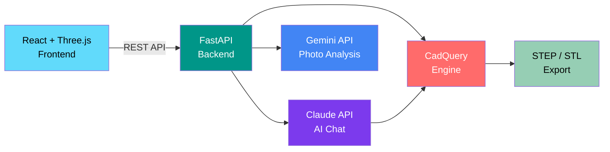

[](https://github.com/Abhishekv87bit/kinetic-forge-studio/actions/workflows/ci.yml)
[](LICENSE)
[](https://www.python.org/downloads/)
[](https://www.typescriptlang.org/)
[](https://react.dev/)
[](https://fastapi.tiangolo.com/)

# Kinetic Forge Studio

AI-powered kinetic sculpture design studio. Design, simulate, and export mechanical art with Claude, Gemini, CadQuery, and Three.js.



## What This Does

Kinetic Forge Studio is a full-stack web application that lets you design kinetic sculptures through natural language conversation with AI. Describe what you want, and the AI generates parametric 3D models using CadQuery, renders them in a Three.js viewport, and exports fabrication-ready STEP files.

**Key features:**
- **AI Chat Interface** — Describe sculptures in plain English, get parametric 3D models
- **Dual AI Engines** — Claude for design reasoning, Gemini for photo-to-model analysis
- **Real-time 3D Viewport** — Three.js/React Three Fiber with orbit controls
- **CadQuery Engine** — Python-based parametric CAD with VLAD validation
- **Export Pipeline** — STEP, STL, and OBJ export for fabrication
- **Component Library** — Reusable parametric parts (gears, lattices, mechanisms)

## Built With

| Layer | Technology |
|-------|-----------|
| Frontend | React 18, TypeScript, Three.js / R3F, Vite, Tailwind CSS |
| Backend | FastAPI, Python 3.12, Pydantic v2 |
| AI | Claude API (Anthropic), Gemini API (Google) |
| CAD | CadQuery 2.x, VLAD Validator |
| Database | ChromaDB (vector search), SQLite |
| Infrastructure | Docker, GitHub Actions |

## Getting Started

### Docker (Recommended)

```bash
cp .env.example .env
# Add your API keys to .env
docker compose up
```

### Manual Setup

```bash
# Backend
cd backend
python -m venv .venv
source .venv/bin/activate  # or .venv\Scripts\activate on Windows
pip install -r requirements.txt
uvicorn app.main:app --reload

# Frontend
cd frontend
npm install
npm run dev
```

## Project Structure

```
├── backend/
│   ├── app/
│   │   ├── engines/       # CadQuery CAD engine
│   │   ├── orchestrator/  # AI chat agent
│   │   ├── importers/     # Photo analysis (Gemini)
│   │   ├── routes/        # FastAPI endpoints
│   │   ├── db/            # Database + component library
│   │   └── middleware/     # Rate limiting, guardrails, observability
│   └── tests/
├── frontend/
│   ├── src/
│   │   ├── components/    # React components
│   │   └── ...
│   └── package.json
├── docker-compose.yml
└── .env.example
```

## License

[MIT](LICENSE)
