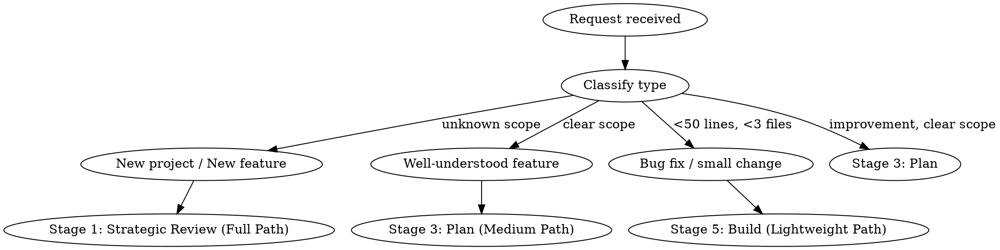

# Pineapple Pipeline

Universal development pipeline. Skills as orchestration, agents as execution.

**Spec:** `docs/superpowers/specs/2026-03-15-pineapple-pipeline-design.md`
**State machine:** `production-pipeline/tools/pipeline_state.py`

## When to Use

Use Pineapple when:
- Starting a new project
- Starting a new feature (any size)
- Making a significant improvement or refactor
- The user says "pineapple", "pipeline", or "full process"

Do NOT use for:
- Quick questions or explanations
- Reading/exploring code without changes
- Tasks already mid-pipeline (resume from `.pineapple/runs/<uuid>/state.json`)

## Stage Routing (Stage 0: Intake)

Classify the request and route to the correct starting stage:

### Path Routing Criteria

- **Lightweight:** <50 lines AND <3 files AND (bug fix or config change)
- **Medium:** <200 lines AND <8 files AND scope clear to both user and agent
- **Full:** Everything else, OR any new project, OR agent uncertainty about scope

### Full Path (new project, new feature, unknown scope)
1. Load context: CLAUDE.md, MEMORY.md, project bible, session handoffs
2. Create pipeline run: `state.create_run(feature, branch)`
3. Proceed to **Stage 1: Strategic Review**

### Medium Path (well-understood feature, clear scope)
1. Load context (same as Full Path)
2. User confirms: "This feature is well-understood, no exploration needed"
3. Write brief spec summary (1-2 paragraphs) to `docs/superpowers/specs/YYYY-MM-DD-<topic>-design.md`
4. Proceed to **Stage 3: Plan**
5. If scope grows during planning, escalate back to Stage 1

### Lightweight Path (bug fix, small change)
1. Write one-paragraph description to `docs/superpowers/fixes/YYYY-MM-DD-<topic>.md`
2. Invoke `superpowers:systematic-debugging` to find root cause
3. Invoke `superpowers:test-driven-development` (write failing test first)
4. Proceed to **Stage 5: Build** -> **Stage 6: Verify** -> **Stage 8: Ship**

## State Machine

Each pipeline run is tracked at `.pineapple/runs/<uuid>/state.json` via `pipeline_state.py`.

- **Create:** `PipelineState(path).create_run(feature, branch)` at Stage 0
- **Advance:** `state.advance(run_id, reason)` at each gate
- **Retry:** `state.retry(run_id, reason)` from Stage 7 back to Stage 5
- **Resume:** On session start, `state.list_active_runs()` -> resume from `current_stage`
- **Truth hierarchy:** state.json > git commits > plan checkboxes

Note: `pipeline_state.py` uses BRAINSTORM enum for Stages 1-2. Naming update pending.

## Separation of Concerns

The executor is NEVER the verifier. Three independent agents per feature:

1. **Builder** (Stage 5) -- writes code, commits. Cannot run tests.
2. **Verifier** (Stage 6) -- runs all 6 verification layers. Fresh context, reads code cold. Cannot have built any of it.
3. **Reviewer** (Stage 7) -- reviews the complete diff against spec. Cannot have built or verified.

This prevents confirmation bias. A builder who tests their own code will miss the same bugs they introduced. A verifier with build context will unconsciously skip the parts they "know" work.

Each agent is dispatched independently by the orchestrator with only the artifacts it needs -- no shared conversation context between builder, verifier, and reviewer.

## The 10 Stages

### Stage 0: Intake
**Actor:** Human + agent context loader

Classify request, load context (CLAUDE.md, MEMORY.md, bible, handoffs), route via path criteria above.

**Gate:** Context loaded, request classified, path chosen.

### Stage 1: Strategic Review
**Invoke:** `pineapple:ceo-review`

CEO skill + Fact-Finding Agent. Find the REAL product, not just what was asked for:
- Ask 5-7 probing questions the human wouldn't think to ask
- Cross-domain pattern matching from adjacent domains
- When a question needs real data, dispatch Fact-Finding Agent (web/doc research)
- Drive toward 10-star version, then scale back to achievable MVP
- Output: **Strategic Brief** (what, why, not-building, who benefits, assumptions, open questions)

**Gate:** Strategic Brief exists. Human approved focus and scope.

### Stage 2: Architecture
**Invoke:** `superpowers:brainstorming`

Read Strategic Brief from Stage 1. Explore context, ask clarifying questions (one at a time, MC preferred), propose 2-3 technical approaches with trade-offs and recommendation. Write spec to `docs/superpowers/specs/`. Spec review loop via subagent, max 5 iterations.

**Gate:** Design spec exists, reviewed, approved by user. No code written yet.

### Stage 3: Plan
**Invoke:** `superpowers:writing-plans`

Read approved spec, map file structure (created, modified, responsibilities), break into chunks of 2-5 Red-Green-Commit tasks. Write plan to `docs/superpowers/plans/`. Dispatch plan reviewer subagent.

**Gate:** Plan exists with checkboxed steps, file map, and verification commands. User approved.

### Stage 4: Setup
**Invoke:** `superpowers:using-git-worktrees`

Create isolated workspace. New projects: run `apply_pipeline.py` to stamp templates. Existing: worktree only. Install dependencies, verify baseline.

**Gate:** Worktree created, dependencies installed, tests pass, services connected.

### Stage 5: Build
**Invoke:** `superpowers:subagent-driven-development`

Execute plan using single-purpose agents. Each coder agent: reads task + relevant files, implements, commits. Review tiering:
- **Trivial** (rename, config): no review dispatch
- **Standard** (wire module, CRUD): Code Quality Reviewer only
- **Complex** (architecture, security): full two-stage review (Spec + Code Quality)

Model selection: haiku for mechanical, sonnet for integration, opus for architecture.

**Rule:** The coder agent MUST NOT run its own tests. Tests are run by the verification agent in Stage 6. The coder agent writes code and commits. Verification is a separate concern handled by a separate agent.

**Gate:** All tasks complete, all reviews pass, all commits made.

### Stage 6: Verify
**Invoke:** `superpowers:verification-before-completion`

**Rule:** The verification agent MUST be a fresh agent with no context from Stage 5 build agents. It reads the code cold and verifies independently. This prevents confirmation bias.

Run 6 verification layers via `python production-pipeline/tools/pineapple_verify.py <project-path>`:
1. Unit tests (`pytest -v`)
2. Integration tests
3. Security tests (adversarial suite)
4. LLM evals (DeepEval)
5. Domain validation (VLAD, Rule 99)
6. Visual inspection (render + screenshot)

**Gate:** All 6 layers pass. Fresh evidence captured. Grep is NEVER verification.

### Stage 7: Review
**Invoke:** `superpowers:requesting-code-review`

**Rule:** The code reviewer MUST NOT be the same agent that built (Stage 5) or verified (Stage 6) the code. Three separate agents: builder, verifier, reviewer.

Final code review on complete diff. Check spec compliance, code quality, security (OWASP Top 10), test coverage.
- **Critical** -> fix immediately, return to Stage 6
- **Important** -> fix before proceeding
- **Minor** -> note for later

**Gate:** No Critical or Important issues open.

### Stage 8: Ship
**Invoke:** `superpowers:finishing-a-development-branch`

Pre-ship check: `.pineapple/verify/<branch>.json` exists, timestamp <2 hours, integrity_hash validates.
Present 4 options: merge locally, push + PR, keep branch, discard.

**Gate:** Work merged or PR created. Bible updated. Worktree cleaned.

### Stage 9: Evolve
**Process:**
1. Write session handoff to `sessions/YYYY-MM-DD.md`
2. Update project bible (close gaps, note progress)
3. Append new decisions to `decisions.md`
4. Run `python production-pipeline/tools/pineapple_evolve.py` (Mem0, Neo4j, baselines)
5. Keep MEMORY.md under 100 lines

**Gate:** Session handoff written, bible updated, decisions logged.

## Failure Handling

### Per-Stage Recovery

| Stage | Max Retries | Recovery | Escalation |
|-------|------------|----------|------------|
| 1 Strategic Review | No limit | Refine questions | Human shelves idea |
| 2 Architecture | No limit | Revise approach | User abandons feature |
| 3 Plan | 3 iterations | Re-dispatch reviewer | Surface to user |
| 4 Setup | 2 | Fix dependency/config | User checks environment |
| 5 Build | 3/task | Resume from failed task | Skip task, note in handoff |
| 6 Verify | 3/layer | Fix layer, re-run only that layer | Surface with evidence |
| 7 Review | 3 cycles | Fix issues, return to Stage 6 | Merge with known issues |
| 8 Ship | 2 | Fix merge conflict | Manual merge by user |
| 9 Evolve | 1 | Retry handoff | Skip, note next session |

### Circuit Breaker (Stage 5-6-7 Loop)
Max 3 full cycles. After 3, stop and present:
1. Merge with known issues documented
2. Return to Stage 2 (redesign approach)
3. Abandon feature

### Rollback Strategy
- Build failure: `git revert` (NOT `git reset --hard`)
- Review critical issues: fixup commit, squash at merge
- Merge conflict: auto-resolve if <3 files, else escalate. Never force-push.

### Wall-Clock Timeout
4 hours per pipeline run. After timeout, present:
1. Continue with fresh timeout
2. Simplify scope
3. Abandon

## Cost Awareness

Estimated cost per pipeline run:
- Small (5 tasks, mostly trivial): ~$10-30
- Medium (15 tasks, mixed): ~$50-150
- Large (30 tasks, complex): ~$150-500

**$200 ceiling.** If session cost exceeds $200, pause and surface:
1. **Continue** -- user accepts higher cost
2. **Pause + resume** -- save state, resume in fresh session
3. **Simplify** -- reduce scope, drop non-critical tasks

Cost controls: review tiering (Stage 5), model selection (haiku/sonnet/opus), path routing (Stage 0).

## Integration

**Required workflow skills (invoked in order):**
- **pineapple:ceo-review** - Stage 1 (Strategic Review)
- **superpowers:brainstorming** - Stage 2 (Architecture)
- **superpowers:writing-plans** - Stage 3 (Plan)
- **superpowers:using-git-worktrees** - Stage 4 (Setup)
- **superpowers:subagent-driven-development** - Stage 5 (Build)
- **superpowers:verification-before-completion** - Stage 6 (Verify)
- **superpowers:requesting-code-review** - Stage 7 (Review)
- **superpowers:finishing-a-development-branch** - Stage 8 (Ship)

**Supporting skills (invoked within stages):**
- **superpowers:test-driven-development** - Used by coder agents in Stage 5
- **superpowers:systematic-debugging** - Used in Lightweight Path
- **superpowers:dispatching-parallel-agents** - Used for independent tasks in Stage 5
- **superpowers:receiving-code-review** - Used when acting on Stage 7 feedback
