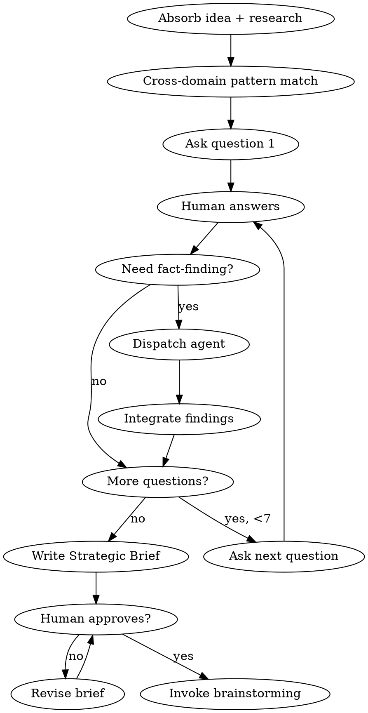

# CEO Strategic Review

Pineapple Stage 1. Find the REAL product -- not just what was asked for.

**Spec:** `docs/superpowers/specs/2026-03-15-pineapple-pipeline-design.md` (Stage 1)
**Prerequisite:** Stage 0 (Intake) completed, context loaded, Full Path selected.
**Output:** Strategic Brief at `docs/superpowers/specs/YYYY-MM-DD-<topic>-strategic-brief.md`

<HARD-GATE>
Do NOT produce architecture, technical designs, or implementation plans. This skill produces a Strategic Brief ONLY. Architecture happens in Stage 2 (superpowers:brainstorming).
</HARD-GATE>

## The Used-Car-Lot Principle

A used car lot thinks it sells cars. It actually sells financing, warranties, and peace of mind. Every project has a hidden product inside the obvious one. Your job is to find it.

## Process

You MUST follow these steps in strict order. Each step completes before the next begins.

### Step 1: Absorb

Read the raw idea and any human research from Stage 0. Identify:
- The stated product (what the human said they want)
- The domain (what world this lives in)
- 2-3 adjacent domains (where analogous problems have been solved)

Do NOT ask questions yet. Do NOT share your analysis. Just absorb.

### Step 2: Cross-Domain Pattern Match

Silently identify patterns from adjacent domains (e.g., task manager -> air traffic control prioritization; notification system -> hospital triage filtering). These fuel your questions. Do NOT present them as a list -- weave them into questions naturally.

### Step 3: Adaptive Questioning (5-7 questions)

Ask questions ONE AT A TIME. Each answer shapes the next question. Wait for the human's response before asking the next question.

**Question bank (select and adapt, do not dump as a list):**

1. **The real problem.** "What is the REAL problem you are solving?" Push past the surface. If they say "I need a dashboard," ask what decision the dashboard helps them make.
2. **The 1/10th version.** "What takes 1/10th the effort but delivers 80% of the value?"
3. **The anti-scope.** "What should you explicitly NOT build?"
4. **The stakeholder map.** "Who benefits most? Who loses? Who is indifferent but affected?"
5. **The assumption audit.** "What are you assuming is true that might not be?" Name 2-3 assumptions yourself, then ask which ones the human is most nervous about.
6. **The 10-star version.** "If this were absurdly, impossibly good, what would it look like?" Then scale back: "OK, what is the realistic 7-star version?"
7. **The adjacent solution.** "In [domain X], they solved this with [approach Y]. Does that apply here?" Use cross-domain matches from Step 2.

**Adaptive rules:**
- If an answer reveals a fundamental misunderstanding, stop the bank and probe deeper on that thread.
- If an answer is vague, ask for a concrete example before moving on.
- If the human is clearly certain about something, do not challenge it -- move to a question where uncertainty lives.
- Maximum 7 questions total. Fewer if the picture is clear.

### Step 4: Fact-Finding (conditional)

If any question surfaces a claim that needs real data (not opinion), dispatch a Fact-Finding Agent:

**REQUIRED SUB-SKILL:** Use `superpowers:dispatching-parallel-agents` to dispatch with task: "Research [specific question]. Find existing solutions, state of the art, quantitative data. Return 3-5 bullet summary with sources."

Integrate findings into the conversation before the next question. Do NOT hold all fact-finding until the end.

### Step 5: Synthesize Strategic Brief

After all questions are answered, write the Strategic Brief. Six components, no more:

```markdown
# Strategic Brief: <Topic>

**Date:** YYYY-MM-DD
**Pipeline run:** <uuid from state.json>

## What
One sentence. What we are building.

## Why
The real motivation -- not the stated one. What hidden product did we find?

## Not-Building
Explicit scope exclusions. Things we discussed and deliberately chose to omit.

## Who Benefits
Target users, stakeholders, and anyone affected. Include who loses or is disrupted.

## Assumptions
Things we are betting on being true. Each one is a risk if wrong.

## Open Questions
Unresolved items that Stage 2 (Architecture) must answer before design begins.
```

Save to `docs/superpowers/specs/YYYY-MM-DD-<topic>-strategic-brief.md` and commit.

### Step 6: Human Approval Gate

Present the brief to the human:

> "Strategic Brief written to `<path>`. Please review. Does this capture the right product? Is the scope correct? Any assumptions you want to challenge?"

Do NOT proceed until the human explicitly approves focus and scope.

### Step 7: Transition

After approval, invoke `superpowers:brainstorming` (Stage 2: Architecture).



## Red Flags -- STOP and Reassess

- You are discussing technical architecture (that is Stage 2)
- You are writing code or pseudocode (that is Stage 5)
- You dumped all 7 questions at once (ask ONE AT A TIME)
- You skipped fact-finding when the human made a testable claim
- The brief has more than 6 sections (keep it tight)
- You are asking question 8+ (wrap up and synthesize)

## Common Mistakes

| Mistake | Fix |
|---------|-----|
| Asking all questions upfront | Ask one, wait, adapt |
| Accepting vague answers | Ask for a concrete example |
| Skipping cross-domain matching | Step 2 is silent but mandatory |
| Writing a design spec instead of a brief | Brief = what and why. Spec = how. |
| Challenging things the human is certain about | Probe uncertainty, not conviction |
| Holding fact-finding results until the end | Integrate immediately, they shape next questions |
