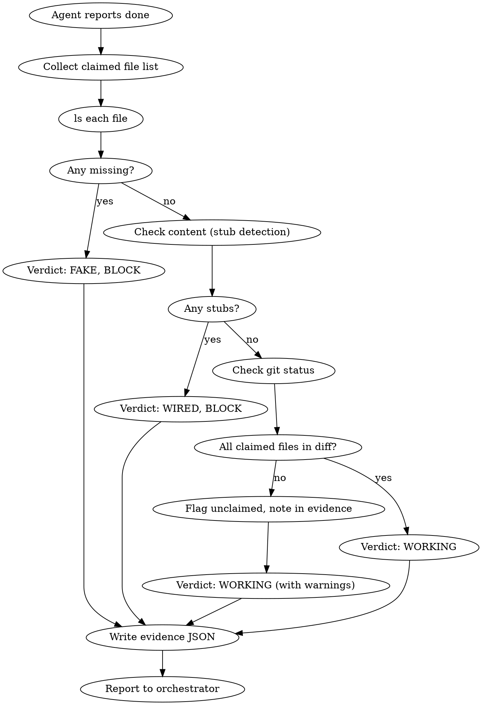

# /verify-outputs -- File Existence Enforcement

Pineapple enforcement skill. After a build or implementation agent reports completion, check that its claimed file outputs actually exist on disk with real implementations.

**Spec:** `docs/ENFORCEMENT_SKILLS_SPEC.md` (Skill 2)
**Prerequisite:** An agent has just claimed to have created or modified files.
**Output:** Evidence file at `.pineapple/evidence/verify-outputs-<timestamp>.json`

<HARD-GATE>
This skill MUST be invoked BEFORE marking any implementation task as complete. If ANY claimed file does not exist on disk, the task is NOT complete. No exceptions. No "it should be there." Check or block.
</HARD-GATE>

## Why This Exists

The 2026-03-23 audit found that build agents report "done" without writing files to disk (H-3), scaffold generators create nothing (H-6), and workspace paths are phantoms (C-2). Every time, the agent said the files existed. Every time, they did not. This skill replaces trust with evidence.

## Inputs

| Input | Type | Required | Description |
|-------|------|----------|-------------|
| `claimed_files` | list of paths | Yes | Files the agent claims to have created or modified |
| `workspace` | path | No | Root directory to check (defaults to current worktree or cwd) |
| `agent_name` | string | No | Which agent made the claims (for evidence file naming) |

## Process

You MUST follow these steps in strict order. Each step completes before the next begins.

### Step 1: Collect Claims

Gather the complete list of file paths the agent claims to have created or modified. If the agent did not provide an explicit list, reconstruct it from the agent's output (look for file paths in commit messages, tool call results, or completion reports).

Do NOT proceed without a concrete list. If you cannot determine what files were claimed, the verdict is FAIL.

### Step 2: Check File Existence

For EACH claimed file path, run:

```bash
ls -la "<file_path>"
```

Record for each file:
- **exists**: Does the file exist at the claimed path? (boolean)
- **size_bytes**: File size in bytes (0 if missing)
- **line_count**: Number of lines (`wc -l` if exists, 0 if missing)
- **first_line**: First non-empty line of the file (for quick identification)

If the workspace itself does not exist, record that immediately -- this is the phantom workspace bug (C-2).

Do NOT use grep or Read to check existence. Use `ls` or `stat`. The file either exists on the filesystem or it does not.

### Step 3: Check File Content (Stub Detection)

For each file that exists, determine whether it contains a real implementation or is a stub.

A file is a **stub** if ANY of these are true:
- The only function/method bodies are `pass`, `...`, or `raise NotImplementedError`
- The file contains only imports and class/function signatures with no logic
- The file is under 5 lines (excluding blank lines and comments)
- The file contains only docstrings and no executable code
- The file has placeholder comments like `# TODO: implement`, `# placeholder`, `# stub`

For Python files specifically, check:
```bash
# Count real code lines (not blank, not comment-only, not just pass/...)
grep -cvE '^\s*$|^\s*#|^\s*(pass|\.\.\.)\s*$' "<file_path>"
```

If a file has fewer than 3 real code lines beyond imports and signatures, it is a stub.

For non-Python files (JS/TS, YAML, JSON, etc.), apply equivalent checks:
- JS/TS: functions with empty bodies `{}` or only `throw new Error("not implemented")`
- JSON/YAML: empty objects/arrays or placeholder values
- Config files: must have real values, not just template markers

### Step 4: Check Git Status

Run:
```bash
git status --porcelain
git diff --stat
```

Cross-reference with claimed files:
- Which claimed files appear in `git status` (modified, added, untracked)?
- Which claimed files are NOT in git status (claimed but unchanged)?
- Are there unexpected files that were modified but not claimed?

A file that was "created" but does not appear in git status as new/modified is suspicious. Record it.

### Step 5: Check for Phantom Paths

Verify structural claims:
- If the agent claimed to create a **directory**, does that directory exist? (`ls -d "<dir_path>"`)
- If the agent claimed to modify a **config file**, is it actually different from the original? (`git diff "<config_path>"`)
- Does the workspace root itself exist on the filesystem?

### Step 6: Classify and Record

Assign the overall verdict using the honest vocabulary:

| Verdict | Condition | Can proceed? |
|---------|-----------|-------------|
| **WORKING** | All claimed files exist AND all contain real implementations (non-stub) | Yes |
| **WIRED** | All claimed files exist BUT some contain stubs or partial implementations | No -- stubs must be completed first |
| **FAKE** | One or more claimed files do not exist on disk | No -- block immediately |

The word "MET" is banned. The word "PASS" maps to WORKING. The word "FAIL" maps to FAKE.

Write the evidence file to `.pineapple/evidence/verify-outputs-<timestamp>.json` where `<timestamp>` is ISO format (e.g., `2026-03-23T14-35-00`).

```bash
mkdir -p .pineapple/evidence
```

### Step 7: Report and Enforce

Present the results to the orchestrator:

**If WORKING:**
> "/verify-outputs: WORKING -- all N claimed files exist with real implementations. Evidence written to `<path>`."

**If WIRED:**
> "/verify-outputs: WIRED -- all files exist but N are stubs. The following files need real implementations before proceeding: [list]. Evidence written to `<path>`."

Do NOT allow the task to be marked complete. The builder must fix the stubs.

**If FAKE:**
> "/verify-outputs: FAKE -- N of M claimed files do not exist on disk. The following files are missing: [list]. Evidence written to `<path>`."

Do NOT allow the task to be marked complete. Do NOT allow advancing to Stage 6. The builder must actually create the files.

## Evidence File Format

```json
{
  "skill": "/verify-outputs",
  "agent": "<agent_name or 'unknown'>",
  "timestamp": "<ISO 8601>",
  "workspace": "<workspace root path>",
  "workspace_exists": true,
  "claimed_files": [
    {
      "path": "src/pineapple/agents/builder.py",
      "exists": true,
      "size_bytes": 8432,
      "line_count": 247,
      "is_stub": false,
      "first_line": "\"\"\"Builder agent -- writes code to disk.\"\"\"",
      "real_code_lines": 183,
      "has_expected_symbols": ["BuilderAgent", "build", "write_files"]
    },
    {
      "path": "src/pineapple/agents/verifier.py",
      "exists": false,
      "size_bytes": 0,
      "line_count": 0,
      "is_stub": false,
      "first_line": null,
      "claimed_but_missing": true
    }
  ],
  "git_status": {
    "modified": ["src/pineapple/agents/builder.py"],
    "untracked": [],
    "claimed_but_not_in_git": ["src/pineapple/agents/verifier.py"]
  },
  "summary": {
    "total_claimed": 2,
    "exist": 1,
    "missing": 1,
    "stubs": 0,
    "real_implementations": 1
  },
  "verdict": "FAKE",
  "verdict_detail": "1/2 claimed files do not exist on disk: src/pineapple/agents/verifier.py",
  "documents_cross_referenced": []
}
```

## Red Flags -- STOP and Reassess

- You are skipping this skill because the agent "seemed confident" it wrote the files
- You are using `grep` or `Read` to check existence instead of `ls`/`stat`
- You are accepting an empty file as "exists" (0 bytes = does not count)
- You are accepting a file with only `pass` bodies as a real implementation
- You are running this skill AFTER marking the task complete (it must run BEFORE)
- You are letting the builder agent run its own /verify-outputs (separation of concerns -- the orchestrator or a separate agent runs this)
- The workspace path does not exist but you are checking files inside it anyway

## Common Mistakes

| Mistake | Fix |
|---------|-----|
| Trusting the agent's completion report | Run ls on every claimed file |
| Skipping stub detection | A file that exists but has only `pass` is not an implementation |
| Checking relative paths without verifying workspace root | Always confirm the workspace directory exists first |
| Running this only for new files | Also verify modified files actually changed (git diff) |
| Letting the builder verify its own outputs | Orchestrator or separate agent runs this skill |
| Accepting "I wrote it but forgot to save" as an excuse | File exists on disk or it does not. No middle ground. |
| Skipping git status cross-reference | A file can exist from a prior run but not be the agent's work |

## Integration Points

- **Stage 5 (Build):** Run /verify-outputs after EACH coder agent completes, not just at the end of the stage.
- **Stage 6 (Verify):** The verification agent should confirm /verify-outputs evidence exists before starting its own checks.
- **Hookify:** STOP rule blocks task completion commits without a /verify-outputs evidence file.
- **Pipeline state:** Do not advance `current_stage` past 5 until /verify-outputs verdict is WORKING.

## Flowchart


