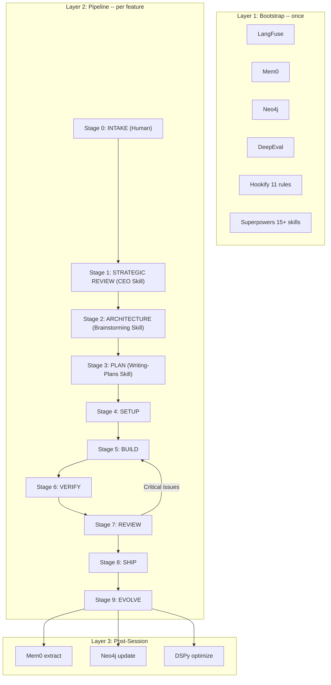

# Pineapple Pipeline -- Design Specification

> **Version:** 1.0.0
> **Status:** ~20% implemented (templates + scaffolding), ~80% planned (pipeline orchestration + tooling)
> **For agentic workers:** REQUIRED: Use superpowers:subagent-driven-development (if subagents available) or superpowers:executing-plans to implement this plan.

**Goal:** A universal, AI-powered development pipeline for building production-grade applications. Pineapple is the meta-process that governs how every app is built -- from brainstorming through shipping and continuous improvement.

**Philosophy:** Skills = cognition (how to think), stages = workflow (when to act), agents = execution (who does it). Every stage defines both human and agent roles. The pipeline is what WE do — human + agent together.

**Foundation:** Built on research from the AI Agent Mastery Plan (7 Permanent Problems, 5 Architecture Patterns, 5 Reasoning Methods, 23 Production Gaps, 8 Phases).

**Source:** `ai-agent-mastery-plan/index.html`

---

## Architecture: Three Execution Layers

Pineapple operates at three frequencies:

```
LAYER 1: BOOTSTRAP (once ever)
  Install shared infrastructure, start services, configure enforcement.
  Frequency: One-time setup.

LAYER 2: PIPELINE (per feature / per project)
  10 stages (0-9) from intake to evolve. Gates between stages.
  Frequency: Every feature or project.

LAYER 3: POST-SESSION TASKS (after each session)
  Memory extraction, prompt optimization, graph updates, dashboards.
  Frequency: Manual steps during Stage 8. Not autonomous daemons.
```



---

## Layer 1: Bootstrap (One-Time Setup)

### Shared Infrastructure

These services run on the developer's machine (Docker containers) and are used by ALL projects. Set up once, never per-project.

| Service | Purpose | Problem Solved | Install | Phase | Status |
|---------|---------|----------------|---------|-------|--------|
| **LangFuse** | Observability, traces, cost dashboards | #5 Verify | `docker run langfuse/langfuse:2.95.1` | Phase 2 | `[PLANNED]` not yet running |
| **Mem0** | Automatic memory extraction + retrieval | #2 Remember | `docker run mem0/mem0:latest` | Phase 5 | `[PLANNED]` |
| **Neo4j** | Graph memory for component relationships | #2 Remember | `docker run neo4j:community-5.26.0` | Phase 6 | `[PLANNED]` |
| **DeepEval** | LLM output quality evaluation | #5 Verify | `pip install deepeval==1.5.5` | Phase 2 | `[PLANNED]` not yet installed |
| **DSPy** | Automatic prompt optimization | #7 Improve | `pip install dspy-ai==2.6.1` | Phase 7 | `[PLANNED]` |
| **Hookify** | Enforcement rules (11 coding standards) | #6 Protect | Already configured in `~/.claude/` | Phase 1 | `[IMPLEMENTED]` 11 rules. Pipeline gates owned by orchestrator (ADR-PPL-14). |
| **Superpowers** | 15 development skills | #4 Coordinate | Already installed as Claude plugin | Phase 1 | `[IMPLEMENTED]` |

### Bootstrap Verification

The `pineapple` CLI is a set of Python scripts in `production-pipeline/tools/`:

| Command | Script | Purpose | Status |
|---------|--------|---------|--------|
| `pineapple doctor` | `tools/pineapple_doctor.py` | Verify all shared services are reachable | `[PLANNED]` |
| `pineapple scaffold <name>` | `tools/apply_pipeline.py` | Stamp out templates for a new project | `[IMPLEMENTED]` |
| `pineapple verify` | `tools/pineapple_verify.py` | Run Stage 5 layers, write verification record | `[PLANNED]` |
| `pineapple evolve` | `tools/pineapple_evolve.py` | Run post-session tasks (Mem0, Neo4j, etc.) | `[PLANNED]` |

All scripts live in `production-pipeline/tools/` and are invoked as `python production-pipeline/tools/<script>.py` (or aliased via shell profile).

```bash
# Run after initial setup to verify all services are reachable
python production-pipeline/tools/pineapple_doctor.py
# Checks: Docker running, LangFuse reachable, Mem0 API responding,
# Neo4j bolt connection, DeepEval installed, hookify rules loaded,
# Superpowers skills available, production-pipeline templates present
# Output: JSON report with pass/fail per service and overall status
```

### Shared Configuration

```
~/.pineapple/
  config.yaml          # Service URLs, API keys, defaults
  docker-compose.yml   # All shared services
  templates/           # Symlink to production-pipeline/templates/
```

Environment variables (set once in shell profile):
```bash
LANGFUSE_URL=http://localhost:3000
MEM0_URL=http://localhost:8080
NEO4J_URL=bolt://localhost:7687
DEEPEVAL_TELEMETRY=NO
```

---

## Layer 2: Pipeline (Per Feature / Per Project)

### Stage 0: INTAKE `[PLANNED]`

**Purpose:** Human-driven. Capture the spark, do initial research, classify the request, load context.

**Primary actor:** Human
**Agent role:** Load context, classify request, suggest routing

**Human workflow:**
1. Human has an idea (spark from video, article, problem encountered, client need)
2. Human does initial research:
   - NotebookLLM for processing documents, papers, videos
   - Web browsing for existing solutions, competitors, state of the art
   - Collecting reference materials, screenshots, examples
3. Human brings the idea + research to the pipeline

**Agent workflow:**
1. Classify request type: new project, new feature, bug fix, improvement
2. Load relevant context:
   - CLAUDE.md (project rules)
   - MEMORY.md (user preferences, decisions)
   - Project bible (gap tracker)
   - Session handoffs (recent work)
3. Route to appropriate starting stage:
   - New project -> Stage 1 (Strategic Review)
   - New feature -> Stage 1 (Strategic Review)
   - Bug fix -> **Lightweight Path** (see below)
   - Well-understood feature -> **Medium Path** (see below)
   - Improvement -> Stage 3 (Plan) if scope is clear

**Path Routing Criteria (quantitative):**
- **Lightweight:** <50 lines changed AND <3 files AND (bug fix or config change)
- **Medium:** <200 lines AND <8 files AND feature scope clear to both user and agent
- **Full:** Everything else, OR any new project, OR agent uncertainty about scope

**Lightweight Path (bug fixes and small changes):**
Bug fixes and changes under ~50 lines skip Stages 1-3 but still require:
1. A one-paragraph description written to `docs/superpowers/fixes/YYYY-MM-DD-<topic>.md`
2. Use `systematic-debugging` skill to find root cause
3. Use `test-driven-development` skill (write failing test first)
4. Proceed to Stage 5 (Build) -> Stage 6 (Verify) -> Stage 8 (Ship)

**Medium Path (well-understood features):**
Features with clear, known scope (e.g., "add pagination to this API") skip Stages 1-2 but keep Stage 3 onward:
1. User confirms the feature is well-understood (no exploration needed)
2. Write a brief spec summary (1-2 paragraphs) to `docs/superpowers/specs/YYYY-MM-DD-<topic>-design.md`
3. Proceed to Stage 3 (Plan) -> Stage 4 (Setup) -> Stage 5 (Build) -> ...
4. If scope turns out to be larger than expected during planning, escalate back to Stage 1

**Gate:** Context loaded, request classified, human research available. Proceed.

**7 Problems addressed:** #1 Think (reasoning about what to do)

---

### Stage 1: STRATEGIC REVIEW `[PLANNED]`

**Purpose:** Find the REAL product. Ask questions the human wouldn't think to ask. Scope, prioritize, and produce a strategic brief.

**Primary actor:** CEO Skill + Fact-Finding Agent
**Human role:** Answer strategic questions, provide domain context, make priority calls

**The used-car-lot principle:** A used car lot thinks it sells cars. Actually it sells financing, warranties, and peace of mind. This stage finds the hidden product inside the obvious product.

**Skill:** `pineapple:ceo-review` (project-agnostic strategic review) `[PLANNED]`

**Process:**
1. CEO Skill hears the raw idea + human's research
2. Cross-domain pattern matching: CEO draws on breadth of LLM training to ask questions from adjacent domains the human wouldn't think of
3. 5-7 probing questions, iterative:
   - "What's the REAL product here?" (not the surface feature)
   - "What's the version that works in 1/10th the effort?"
   - "You're assuming X. What if X isn't true?"
   - "In [adjacent domain], they solved this with Y. Does that apply?"
   - "Who benefits and how? What are the underlying value drivers for ALL parties?"
   - "What should you NOT build?"
4. When a question needs real data (not opinion), dispatch **Fact-Finding Agent**:
   - Searches web for existing solutions, competitors
   - Reads docs, papers, repos
   - Summarizes state of the art
   - Returns structured findings back to the dialogue
5. Drive toward 10-star version, then scale back to achievable MVP
6. Output: **Strategic Brief** (not a spec, not architecture):
   - What we're building (1 sentence)
   - Why (the real value, not the surface feature)
   - What we're NOT building (explicit exclusions)
   - Who benefits and how
   - Key assumptions to validate
   - Open questions only the human can answer

**Gate:** Strategic Brief exists. Human approved focus and scope. Proceed to architecture.

**7 Problems addressed:** #1 Think (cross-domain reasoning), #4 Coordinate (strategic alignment before design)

---

### Stage 2: ARCHITECTURE `[PLANNED]`

**Purpose:** Turn the strategic brief into a validated technical design.

**Primary actor:** Brainstorming Skill
**Human role:** Approve design decisions, provide technical constraints

**Skill:** `superpowers:brainstorming` (9-step process)

**Process:**
1. Read Strategic Brief from Stage 1
2. Explore project context (files, docs, commits)
3. Ask clarifying questions (one at a time, multiple choice preferred)
4. Propose 2-3 technical approaches with trade-offs and recommendation
5. Present design sections, get approval after each
6. Write design spec to `docs/superpowers/specs/YYYY-MM-DD-<topic>-design.md`
7. Spec review loop (dispatch spec-document-reviewer subagent, max 5 iterations)
8. User reviews written spec

**Gate:** Design spec exists, reviewed, approved by user. No code written yet.

**7 Problems addressed:** #1 Think (Tree of Thoughts via multiple approaches), #4 Coordinate (design before implementation)

---

### Stage 3: PLAN `[PLANNED]`

**Purpose:** Break the approved design into bite-sized, executable tasks.

**Primary actor:** Writing-Plans Skill
**Human role:** Review and approve implementation plan

**Skill:** `superpowers:writing-plans`

**Process:**
1. Read the approved spec from Stage 2
2. Map file structure: which files created, which modified, responsibilities
3. Break into chunks of 2-5 tasks each
4. Each task follows Red-Green-Commit: write failing test -> implement -> verify green -> commit
5. Write plan to `docs/superpowers/plans/YYYY-MM-DD-<topic>.md`
6. Dispatch plan-document-reviewer subagent
7. User reviews plan

**Gate:** Plan exists with checkboxed steps, file map, and verification commands. User approved.

**7 Problems addressed:** #1 Think (Plan-and-Execute reasoning), #5 Verify (test-first approach baked in)

---

### Stage 4: SETUP `[PARTIALLY IMPLEMENTED]` (apply_pipeline.py exists, worktree integration planned)

**Purpose:** Create isolated workspace and wire project infrastructure.

**Primary actor:** Orchestrator
**Human role:** Approve worktree/branch setup

**Skill:** `superpowers:using-git-worktrees`

**Process:**
1. Create git worktree for feature isolation
2. If NEW project:
   - Run `apply_pipeline.py` to stamp out templates:
     - `Dockerfile.fastapi` + `Dockerfile.vite` + `docker-compose.yml` (exists)
     - `.github/workflows/ci.yml` (exists)
     - `app/middleware/input_guardrails.py` (exists)
     - `app/middleware/observability.py` (exists)
     - `app/middleware/rate_limiter.py` (exists)
     - `app/middleware/resilience.py` (exists)
     - `env.template` (exists)
     - `app/middleware/cache.py` (exists in templates, NOT YET in apply_pipeline.py)
     - `mcp_server.py` (exists in templates, NOT YET in apply_pipeline.py)
     - `tests/test_adversarial.py` (NOT YET created as template)
     - `tests/test_eval_benchmark.py` (NOT YET created as template)
   - Connect to shared services via env vars
   - Create project bible (`projects/<name>-bible.yaml`)
3. If EXISTING project:
   - Worktree only, services already connected
4. Install dependencies
5. Verify baseline: all existing tests pass, shared services reachable

**Gate:** Worktree created, dependencies installed, tests pass, services connected.

**Templates applied (per-project, from `production-pipeline/templates/`):**

| Template | Covers Gap | Problem Solved |
|----------|-----------|----------------|
| `Dockerfile.fastapi` | #1 Docker | #6 Protect |
| `Dockerfile.vite` | #1 Docker | #6 Protect |
| `docker-compose.template.yml` | #1 Docker | #6 Protect |
| `ci.github-actions.yml` | #2 CI/CD | #5 Verify |
| `env.template` | #10 Cloud Deploy | #6 Protect |
| `input_guardrails.py` | #5 Guardrails | #6 Protect |
| `observability.py` | #3 Observability | #5 Verify |
| `rate_limiter.py` | #13 Rate Limiting | #6 Protect |
| `resilience.py` | #8 Resilience | #6 Protect |
| `cache.py` | #9 Caching | #7 Improve |
| `mcp_server.py` | #14 MCP Exposure | #3 Act |

**7 Problems addressed:** #3 Act (tool setup), #6 Protect (security templates applied)

---

### Stage 5: BUILD `[PLANNED]`

**Purpose:** Execute the plan using single-purpose agents with two-stage review.

**Primary actor:** SDD / executing-plans
**Human role:** Provide clarifications, answer agent questions

**Skill:** `superpowers:subagent-driven-development`

**Process (per task in the plan):**
1. Dispatch **Coder Agent** (single-purpose, fresh context per task)
   - Reads only: the task description, relevant files, project conventions
   - Writes: code + tests following the plan's steps
   - Commits after each task
2. Dispatch **Spec Reviewer Agent** (checks implementation matches spec)
   - Does the code do what the spec says?
   - Are edge cases handled?
   - Fix issues, re-dispatch if needed
3. Dispatch **Code Quality Reviewer Agent** (checks code quality)
   - Style, patterns, security, performance
   - Fix issues, re-dispatch if needed
4. Mark task complete, move to next

**Model selection per agent:**
- Mechanical tasks (rename, move, template fill) -> haiku (fast, cheap)
- Integration tasks (wire modules, add middleware) -> sonnet (balanced)
- Architecture tasks (design patterns, complex logic) -> opus (capable)

**Parallelization:** Independent tasks can run simultaneously via `dispatching-parallel-agents`. Tasks with dependencies run sequentially.

**Review tiering (cost control):**
Not every task needs full two-stage review. Tier the review depth by task complexity:
- **Trivial tasks** (rename, config, template fill): No review dispatch. Coder agent commits directly.
- **Standard tasks** (wire module, add route, CRUD): Code Quality Reviewer only. Skip Spec Reviewer.
- **Complex tasks** (architecture, security, data model): Full two-stage review (Spec + Code Quality).

This reduces agent dispatches from 3-per-task to 1-3-per-task depending on complexity.

**Gate:** All tasks complete, all per-task reviews pass, all commits made.

**7 Problems addressed:** #1 Think (ReAct loop per agent), #4 Coordinate (orchestrator-workers pattern), #5 Verify (two-stage review)

---

### Stage 6: VERIFY `[PLANNED]` (pineapple_verify.py not yet implemented)

**Purpose:** Multi-layer verification before any merge or release.

**Primary actor:** pineapple_verify.py
**Human role:** Review verification results

**Skill:** `superpowers:verification-before-completion`

**6 Verification Layers:**

| Layer | What It Checks | Tool | Gap Covered |
|-------|---------------|------|-------------|
| 1. Unit Tests | Code correctness | `pytest -v` | #2 CI/CD |
| 2. Integration Tests | Components work together | `pytest tests/test_integration.py` | #2 CI/CD |
| 3. Security Tests | Attack resistance | `pytest tests/test_adversarial.py` | #6 Adversarial |
| 4. LLM Evals | Output quality | `deepeval test run` | #4 LLM Eval |
| 5. Domain Validation | Domain-specific checks | VLAD, validators, Rule 99 | #5 Verify |
| 6. Visual Inspection | Looks correct | Render + screenshot | #5 Verify |

**Verification Framework (from `feedback_verification.md`):**
1. **Contract test** -- feature is CALLED during actual execution
2. **Output correctness** -- output is CORRECT (not just present)
3. **Regression detection** -- no quality degradation vs baseline
4. **Runtime counters** (optional) -- ongoing usage confirmed

**Iron law:** Grep is NEVER verification. `ls` is NEVER verification. Evidence before assertions.

**Cross-model verification (Phase 5+ only):**
- For critical outputs, run through 2 models (Claude + Gemini)
- Agreement = high confidence
- Disagreement = flag for human review

**Gate:** All 6 layers pass. Fresh evidence captured. No stale "it worked last time."

**7 Problems addressed:** #5 Verify (all 5 validation layers from the matrix), #6 Protect (adversarial testing)

---

### Stage 7: REVIEW `[PLANNED]`

**Purpose:** Final code review on the complete diff before merging.

**Primary actor:** Code review skills
**Human role:** Make final go/no-go decision on review findings

**Skill:** `superpowers:requesting-code-review`

**Process:**
1. Get git SHAs for all commits in the feature
2. Dispatch code-reviewer agent with:
   - Full diff (`git diff base...HEAD`)
   - The original spec (from Stage 2)
   - The plan (from Stage 3)
3. Reviewer checks:
   - Spec compliance (does it do what was designed?)
   - Code quality (patterns, naming, structure)
   - Security (OWASP Top 10 for LLMs)
   - Test coverage (are edge cases tested?)
4. Act on feedback:
   - Critical -> fix immediately, return to Stage 6
   - Important -> fix before proceeding
   - Minor -> note for later

**Gate:** Code review passes with no Critical or Important issues open.

**7 Problems addressed:** #5 Verify (evaluator-optimizer pattern), #1 Think (Reflexion -- learn from reviewer feedback)

---

### Stage 8: SHIP `[PLANNED]`

**Purpose:** Integrate work and deploy.

**Primary actor:** Orchestrator + human
**Human role:** Approve merge, verify deployment

**Skill:** `superpowers:finishing-a-development-branch`

**4 Options presented to user:**
1. Merge back to base branch locally
2. Push and create Pull Request
3. Keep branch as-is
4. Discard work (requires typed confirmation)

**For options 1 & 2:**
- Verify tests pass on merged result
- Clean up worktree
- Update project bible (close relevant gaps)
- Update decisions.md if new decisions were locked

**Deployment (Phase 4+ only):**
- Docker build + push to registry
- Deploy to Railway / Fly.io / VPS
- Smoke test deployed instance
- Monitor LangFuse for errors in first hour

**Gate:** Work merged or PR created. Bible updated. Worktree cleaned.

**7 Problems addressed:** #6 Protect (safe merge), #4 Coordinate (clean integration)

---

### Stage 9: EVOLVE `[PLANNED]` (pineapple_evolve.py not yet implemented)

**Purpose:** Learn from this cycle, improve for the next one.

**Primary actor:** pineapple_evolve.py + human
**Human role:** Review session handoff, provide corrections, confirm accuracy

**Skill:** Session handoff protocol (from MEMORY.md)

**Process:**
1. Write session handoff to `sessions/YYYY-MM-DD.md`:
   - What was done
   - Files created/modified
   - Test results
   - Issues encountered
   - Next session items
2. Update project bible (close gaps, note progress)
3. Append new decisions to `decisions.md`
4. Feed learnings to shared services:
   - **Mem0:** Extract facts from session (what worked, what broke)
   - **Neo4j:** Update component relationship graph
   - **DeepEval:** Update baseline scores if evals improved
   - **DSPy:** Queue prompt optimization if prompts were changed
5. Keep MEMORY.md under 100 lines

**Gate:** Session handoff written, bible updated, decisions logged.

**7 Problems addressed:** #2 Remember (memory persistence), #7 Improve (cross-session learning)

---

## Failure Handling Between Stages

### Stage Failure Recovery

| Failed Stage | Recovery Action | Max Retries | Escalation |
|-------------|----------------|-------------|------------|
| Stage 1 (Strategic Review) | Refine questions, re-engage human | No limit (human-driven) | Human decides to shelve idea |
| Stage 2 (Architecture) | Revise approach, re-present to user | No limit (user-driven) | User abandons feature |
| Stage 3 (Plan) | Revise plan, re-dispatch reviewer | 3 iterations | Surface to user for guidance |
| Stage 4 (Setup) | Fix dependency/config issue, retry | 2 retries | Ask user to check environment |
| Stage 5 (Build) | Resume from failed task (not restart) | 3 retries per task | Skip task, note in handoff |
| Stage 6 (Verify) | Fix failed layer, re-run ONLY that layer | 3 retries per layer | Surface to user with evidence |
| Stage 7 (Review) | Fix issues, return to Stage 6 (verify fix) | 3 review cycles | Merge with known issues documented |
| Stage 8 (Ship) | Fix merge conflict, retry | 2 retries | Manual merge by user |
| Stage 9 (Evolve) | Retry handoff write | 1 retry | Skip handoff, note in next session |

### Circuit Breaker: Stage 5-6-7 Loop

The Build -> Verify -> Review cycle can loop. To prevent infinite loops:
- **Max 3 full cycles** (Build -> Verify -> Review = 1 cycle)
- After 3 cycles, stop and present to user: "These issues persist after 3 attempts: [list]. Options: (a) merge with known issues, (b) redesign approach (return to Stage 2), (c) abandon feature."
- Each cycle is logged in the session handoff for future learning.

### Rollback Strategy

| Failure | Rollback Action |
|---------|----------------|
| Stage 5 Build: task fails tests | `git revert` the task's commits. Do NOT `git reset --hard`. |
| Stage 7 Review: Critical issues | Create fixup commit to address issues. Fixups squashed at merge in Stage 8. |
| Stage 8 Ship: merge conflict | Attempt auto-resolve. If >3 conflicting files, escalate to user. Never force-push. |

**Wall-clock timeout:** Max 4 hours per pipeline run. After 4h, pause and surface to user with options: (a) continue with fresh timeout, (b) simplify scope, (c) abandon.

### Partial Resume

Pipeline state is tracked via a persistent state machine:
- **Primary:** `.pineapple/runs/<uuid>/state.json` -- single source of truth (JSON state machine with atomic writes)
- **Secondary:** Git commits preserve partial progress (each task commits independently)
- **Tertiary:** Plan checkboxes (`- [x]`) provide human-readable progress
- If a session is interrupted, the next session reads the state machine and resumes from the current stage.
- If state machine and plan checkboxes disagree, the state machine wins.

---

## Pipeline Cost Model

Running the full pipeline has a cost. Understanding the expected range prevents surprise bills and informs when to use lighter paths.

**Per-task agent dispatch costs (approximate):**

| Agent | Model | Cost/Dispatch | When Used |
|-------|-------|--------------|-----------|
| Coder Agent | haiku/sonnet/opus | $0.50-$15 | Every task |
| Spec Reviewer | sonnet/opus | $3-$15 | Complex tasks only |
| Code Quality Reviewer | sonnet | $3-$5 | Standard + complex tasks |

**Estimated cost per pipeline run:**

| Plan Size | Review Tier | Dispatches | Estimated Cost |
|-----------|------------|------------|---------------|
| Small (5 tasks, mostly trivial) | Mixed | ~8 | $10-$30 |
| Medium (15 tasks, mixed complexity) | Mixed | ~25 | $50-$150 |
| Large (30 tasks, complex) | Full | ~60 | $150-$500 |

**Cost control mechanisms:**
1. **Review tiering** (Stage 5): Skip reviews for trivial tasks, single-review for standard
2. **Model selection**: Use haiku for mechanical work, reserve opus for architecture
3. **Path routing** (Stage 0): Lightweight/Medium paths skip strategic review + architecture for small changes
4. **Early exit**: If Stage 6 catches fundamental issues, return to Stage 2 rather than looping Stage 5-6-7

**Cost ceiling alert:** If total session cost exceeds $200, pause and surface to user: "Session cost is at $X. Options: (a) continue, (b) pause and resume later, (c) simplify approach."

---

## Scalability Constraints

Pineapple is designed for:
- **Single developer** on a **single machine**
- **1-3 concurrent features** (worktree-isolated, each with independent pipeline state)
- **Local Docker services** (LangFuse, Mem0, Neo4j on localhost)

NOT designed for: multi-developer teams, CI/CD orchestration, cloud-hosted pipeline state, or >3 concurrent pipeline runs. Multi-developer support is a Phase 6+ concern (GAP-PPL-015 Multi-Tenancy).

**Concurrent feature isolation:** Each pipeline run gets a UUID and stores state at `.pineapple/runs/<uuid>/state.json`. Verification records are per-branch at `.pineapple/verify/<branch-name>.json`. No shared mutable state between concurrent runs.

---

## Layer 3: Post-Session Tasks

These are manual steps executed during Stage 9 (Evolve), not autonomous background daemons. They accumulate value across sessions and projects.

**Trigger mechanism:** Each is a manual step in Stage 9 (Evolve). Future enhancement: post-session hook that runs `pineapple evolve` automatically.

| Process | Service | What It Does | When Triggered |
|---------|---------|-------------|----------------|
| Memory extraction | Mem0 | Extracts facts from session handoffs, user corrections, decisions | Stage 9, step 4 (manual) |
| Prompt optimization | DSPy | Uses eval benchmarks as fitness function, searches for better prompts | Manual: `python production-pipeline/tools/pineapple_optimize.py` (Phase 7) |
| Graph updates | Neo4j | Updates component relationships, dependency tracking | Stage 9, step 4 (manual) |
| Cost dashboards | LangFuse | Tracks cost trends, latency, error rates across all projects | Passive (auto-collects during Stage 5) |
| Quality tracking | DeepEval | Monitors LLM output quality scores over time, alerts on regression | After each Stage 6 eval run |
| Hookify enforcement | Hookify | Coding standards enforcement (11 rules) | Every tool call (automatic) |

---

## 7 Permanent Problems -- Complete Integration Matrix

### 1. How to Think -- Reasoning Patterns

| Pattern | Where Used in Pipeline | Implementation |
|---------|----------------------|----------------|
| Chain of Thought | Every LLM call (system prompts include "think step by step") | Built into prompt templates |
| ReAct | Stage 5 (Build) -- coder agents reason-act-observe-repeat | Built into SDD skill |
| Reflexion | Stage 7 (Review) -- learn from reviewer feedback, improve | Built into receiving-code-review skill |
| Plan-and-Execute | Stage 3 (Plan) -> Stage 5 (Build) | Built into writing-plans + executing-plans |
| Tree of Thoughts | Stage 2 (Architecture) -- explore 2-3 approaches | Built into brainstorming skill |
| Cross-Domain Reasoning | Stage 1 (Strategic Review) -- CEO skill connects adjacent domains | Built into CEO skill |
| Self-Consistency | Stage 6 (Verify) -- cross-model verification | GAP-PPL-017 (Phase 5) |

**Status:** Strong. All patterns covered through existing skills.

### 2. How to Remember -- Memory Systems

| Memory Type | Where Used | Implementation | Status |
|-------------|-----------|----------------|--------|
| Sensory | Stage 0 (Intake) -- raw user input + research | Context window | Have it |
| Working | Stage 5 (Build) -- agent scratchpad | TodoWrite, in-context | Have it |
| Episodic | Stage 9 (Evolve) -- session handoffs | `sessions/YYYY-MM-DD.md` | Have it |
| Semantic | Stage 0 (Intake) -- project knowledge | MEMORY.md, CLAUDE.md, decisions.md | Have it |
| Procedural | All stages -- skills and workflows | Superpowers skills, Rule 99/500 | Have it |
| Strategic/Meta | Background Loop -- performance analysis | Mem0 + DeepEval trends | GAP-PPL-011,023 |

**Status:** Partial. 5/6 types covered. Strategic/Meta needs Mem0 + cross-session learning.

### 3. How to Act -- Tool Use

| Tool Category | Implementation | Status |
|--------------|---------------|--------|
| Code execution | CadQuery engine, subprocess sandbox | Have it |
| File operations | Read, Write, Edit, Glob, Grep tools | Have it |
| API calls | httpx, Claude/Gemini/Groq clients | Have it |
| MCP servers | FreeCAD MCP, KFS MCP (3 tools), openscad-mcp | Have it |
| Function calling | Anthropic tool use in chat_agent.py | Have it |
| Tool RAG | Not implemented (for large tool sets) | Future |

**Status:** Strong. MCP exposure now complete.

### 4. How to Coordinate -- Orchestration

| Pattern | Where Used | Implementation | Status |
|---------|-----------|----------------|--------|
| Pipeline/Chain | Full pipeline (Stage 0-9) | Pineapple itself | Have it |
| Router | Stage 0 (Intake) -- route to right starting point | using-superpowers skill | Have it |
| Orchestrator-Workers | Stage 5 (Build) -- dispatch coder + reviewer agents | SDD skill | Have it |
| Evaluator-Optimizer | Stage 6-7 (Verify + Review) -- generate-judge-improve | verification + code-review skills | Have it |
| Hierarchical | Rule 99 (3 gates, 14 consultants) | Rule 99 pipeline | Have it |
| Parallelization | Stage 4 -- independent tasks in parallel | dispatching-parallel-agents skill | Partial (GAP-PPL-022) |

**Status:** Strong. All 5 patterns used. Parallelization improvement planned.

### 5. How to Verify -- Validation & Evaluation

| Layer | Tool | Stage | Status |
|-------|------|-------|--------|
| Structure validation | Pydantic models | Stage 5 (Build) | Have it |
| Logic validation | pytest (unit + integration) | Stage 6 Layer 1-2 | Have it |
| Quality evaluation | DeepEval (LLM-as-judge) | Stage 6 Layer 4 | Need setup |
| Safety validation | Adversarial test suite (67 patterns) | Stage 6 Layer 3 | Have it |
| Domain validation | VLAD (35 checks, 8 tiers), Rule 99 | Stage 6 Layer 5 | Have it |
| Visual validation | Render + screenshot + VLM | Stage 6 Layer 6 | Have it |
| Cross-model | Run through 2 models, compare | Stage 6 (Phase 5+) | GAP-PPL-017 |
| Regression | Baseline comparison, fingerprinting | Background Loop | Partial |

**Status:** Excellent. 6/8 layers active. Cross-model and formal regression tracking planned.

### 6. How to Protect -- Security & Guardrails

| Layer | Tool | Template | Status |
|-------|------|----------|--------|
| Input sanitization | `input_guardrails.py` (67 attack patterns) | `templates/input_guardrails.py` | Have it |
| Rate limiting | slowapi (per-route limits) | `templates/rate_limiter.py` | Have it |
| Resilience | Circuit breaker + retry + fallback | `templates/resilience.py` | Have it |
| CORS lockdown | FastAPI CORS middleware | Per-project config | Have it |
| Auth | API keys / OAuth2 | Per-project | GAP-PPL-015 (Phase 6) |
| Subprocess sandbox | AST whitelist, path traversal prevention | Per-project | Have it |
| Hookify enforcement | 11 rules blocking dangerous patterns | `~/.claude/` | Have it |
| Cost budget | Token tracking + alerts | `templates/observability.py` | Have it |

**Status:** Strong. 7/8 layers active. Auth planned for Phase 6.

### 7. How to Improve -- Optimization & Learning

| Method | Tool | Where Used | Status |
|--------|------|-----------|--------|
| Session handoffs | `sessions/YYYY-MM-DD.md` | Stage 9 (Evolve) | Have it |
| Decision logging | `decisions.md` (append-only) | Stage 9 (Evolve) | Have it |
| Bible tracking | `projects/*-bible.yaml` | Stage 8-9 (Ship + Evolve) | Have it |
| Prompt optimization | DSPy | Background Loop | GAP-PPL-018 (Phase 7) |
| Fine-tuning | LoRA via Unsloth | Background Loop | GAP-PPL-021 (Phase 7) |
| Cross-session learning | Mem0 fact extraction | Background Loop | GAP-PPL-023 (Phase 7) |
| Reflexion | Review feedback -> improve | Stage 7 (Review) | Have it |

**Status:** Weak. Manual improvement (handoffs, decisions) works. Automatic improvement (DSPy, LoRA, Mem0) not yet implemented.

---

## 8-Phase Implementation Roadmap

Each phase builds on the previous. Gaps are closed incrementally as you use the pipeline.

**Important: Template vs. Gap Closure distinction.**
Phase statuses below reflect KFS (Kinetic Forge Studio), the first project built with this pipeline. For NEW projects scaffolded by `apply_pipeline.py`:
- **Template stamped** = the `.py` file exists in the project. This is immediate (Stage 3).
- **Template configured** = project-specific routes, models, and patterns filled in. This requires per-project work.
- **Gap functionally closed** = tests written, passing, integrated into CI. This is the real closure.

A new project inherits templates from Phase 1-4 instantly but must do per-project configuration and testing to functionally close each gap. Do not skip gap closure just because a template exists.

### Phase 1: Deployable (KFS: CLOSED, New projects: templates stamped) `[IMPLEMENTED]`

| Gap | Title | Status | Template |
|-----|-------|--------|----------|
| #1 | Containerization (Docker) | CLOSED | `Dockerfile.fastapi`, `Dockerfile.vite`, `docker-compose.template.yml` |
| #2 | CI/CD Pipeline | CLOSED | `ci.github-actions.yml` |
| #13 | Rate Limiting & Quotas | CLOSED | `rate_limiter.py` |

**Result:** App can be run by anyone, tested automatically, protected from abuse.

### Phase 2: Observable (KFS: CLOSED, New projects: templates stamped) `[IMPLEMENTED]`

| Gap | Title | Status | Template/Tool |
|-----|-------|--------|---------------|
| #3 | Observability / Tracing | CLOSED | `observability.py` (LangFuse) |
| #7 | Cost Tracking & Token Budget | CLOSED | `observability.py` (cost per request) |
| #4 | Automated LLM Eval | CLOSED | `test_llm_eval.py` (135/135 tests) |

**Result:** Can see what's happening, how much it costs, whether quality is changing.

### Phase 3: Trustworthy (KFS: CLOSED, New projects: templates stamped) `[IMPLEMENTED]`

| Gap | Title | Status | Template/Tool |
|-----|-------|--------|---------------|
| #5 | Prompt-Level Guardrails | CLOSED | `input_guardrails.py` (67 patterns) |
| #6 | Adversarial Testing | CLOSED | `test_adversarial.py` (97/97 tests) |
| #8 | Error Recovery / Resilience | CLOSED | `resilience.py` (circuit breaker + retry) |

**Result:** App handles attacks, bad input, and failures without crashing.

### Phase 4: Connected (KFS: 2/3 CLOSED, New projects: templates stamped) `[PARTIALLY IMPLEMENTED]`

| Gap | Title | Status | Template/Tool |
|-----|-------|--------|---------------|
| #9 | Caching Layer | CLOSED | `cache.py` (TTLCache + Anthropic prompt caching) |
| #14 | MCP Exposure | CLOSED | `mcp_server.py` + `kfs_mcp_server.py` |
| #10 | Cloud Deployment | DEFERRED | Docker + Railway/Fly.io |

**Result:** App is cacheable and usable by other AI tools via MCP. Cloud deployment deferred.

### Phase 5: Smart (NEXT) `[PLANNED]`

| Gap | Title | Priority | Tool | Shared/Per-Project |
|-----|-------|----------|------|-------------------|
| #16 | Context Engineering Formalization | P3 | Anthropic's 4 strategies in prompt_builder | Per-project |
| #17 | Cross-Model Verification | P3 | Dual-model on critical paths | Per-project template |
| #11 | Dedicated Memory Service | P3 | Mem0 (Docker) | Shared service |

**Result:** Agent uses context efficiently, verifies its own outputs, remembers automatically.

**New templates needed:**
- `cross_model_verify.py` -- dual-model verification pattern
- `mem0_client.py` -- Mem0 integration helper
- `context_optimizer.py` -- context window management

### Phase 6: Multi-User `[PLANNED]`

| Gap | Title | Priority | Tool | Shared/Per-Project |
|-----|-------|----------|------|-------------------|
| #15 | Multi-Tenancy / Auth | P3 | OAuth2 + per-user DB | Per-project |
| #12 | Graph Memory | P3 | Neo4j Community (Docker) | Shared service |

**Result:** Multiple users, complex assemblies, proper data isolation.

**New templates needed:**
- `auth_middleware.py` -- OAuth2 / API key auth
- `graph_memory.py` -- Neo4j/NetworkX integration

### Phase 7: Evolving `[PLANNED]`

| Gap | Title | Priority | Tool | Shared/Per-Project |
|-----|-------|----------|------|-------------------|
| #18 | DSPy / Prompt Optimization | P3 | DSPy | Shared tool |
| #22 | Workflow Parallelization | P4 | asyncio.gather patterns | Per-project template |
| #23 | Self-Evolving Agent | P4 | Reflexion + Mem0 feedback loops | Per-project + shared |
| #21 | Fine-Tuning (LoRA) | P4 | Unsloth + training data | Shared tool |

**Result:** Agent gets better over time, runs faster, generates higher quality code.

**New templates needed:**
- `dspy_optimizer.py` -- prompt optimization starter
- `parallel_orchestrator.py` -- asyncio.gather for independent tasks

### Phase 8: Future `[PLANNED]`

| Gap | Title | Priority | Tool | Shared/Per-Project |
|-----|-------|----------|------|-------------------|
| #19 | Voice Interface | P4 | ElevenLabs TTS + Whisper STT | Per-project |
| #20 | A2A Protocol | P4 | Google ADK | Per-project |

**Result:** Natural voice interaction, inter-agent collaboration with external systems.

---

## Enforcement Model (ADR-PPL-14) `[PARTIALLY IMPLEMENTED]`

**Two-layer enforcement, one concern per layer:**

| Layer | System | What It Enforces | Status |
|-------|--------|-----------------|--------|
| Coding standards | Hookify (11 existing rules) | Verification evidence, gap closure evidence, dangerous patterns | `[IMPLEMENTED]` |
| Pipeline flow | Orchestrator (master skill) | Stage gates, transition rules, verification before merge | `[PLANNED]` |

**Why not hookify for pipeline gates:** The orchestrator already enforces every gate by refusing to advance stages without conditions met. Adding hookify rules for the same gates creates double maintenance, conflicting failure modes, and fragile Windows hook registration. If the orchestrator is bypassed and bad habits emerge, hookify gates can be added as a corrective measure (ADR-PPL-14).

**Verification records:** Stage 6 (Verify) writes a signed verification record per branch at `.pineapple/verify/<branch-name>.json`:
```json
{
  "version": "1.0.0",
  "run_id": "uuid",
  "branch": "feat/my-feature",
  "timestamp": "2026-03-15T14:30:00Z",
  "layers_passed": [1, 2, 3, 4, 5, 6],
  "layers_failed": [],
  "test_count": 47,
  "all_green": true,
  "evidence_hash": "sha256 of concatenated test output",
  "integrity_hash": "sha256 of (evidence_hash + run_id + branch + timestamp)"
}
```
The orchestrator checks before allowing Stage 8 (Ship): (1) file exists for the current branch, (2) timestamp < 2 hours, (3) `integrity_hash` validates against `evidence_hash`. The `integrity_hash` cannot be forged without running real tests (which produce the `evidence_hash`).

**Per-branch isolation:** Each feature branch gets its own verification record. Feature A's passing verification does NOT satisfy Feature B's merge gate.

**Lightweight/Medium Path exemption:** Files in `docs/superpowers/fixes/` satisfy the spec requirement for Lightweight Path. Medium Path requires a brief spec file in `docs/superpowers/specs/`.

---

## Per-Project Scaffolding

When starting a new project, `apply_pipeline.py` creates:

```
my-new-project/
  backend/
    app/
      middleware/
        cache.py              # GAP #9
        input_guardrails.py   # GAP #5
        observability.py      # GAP #3
        rate_limiter.py       # GAP #13
        resilience.py         # GAP #8
    mcp_server.py             # GAP #14
    Dockerfile                # GAP #1
    pyproject.toml
    tests/
      test_adversarial.py     # GAP #6
      test_eval_benchmark.py  # GAP #4
      test_health.py
  frontend/
    Dockerfile                # GAP #1
  .github/
    workflows/
      ci.yml                  # GAP #2
  docker-compose.yml          # GAP #1
  .env.example                # GAP #10
  .mcp.json                   # GAP #14
  .pineapple/
    runs/                     # Pipeline state per run (auto-generated)
    verify/                   # Verification records per branch (auto-generated)
  CLAUDE.md                   # Project rules
  memory/
    MEMORY.md                 # Auto-memory index
  projects/
    <name>-bible.yaml         # Gap tracker
```

Every template is already battle-tested in KFS (Kinetic Forge Studio). Note: templates are stamped (file exists) but not configured — each project must fill in project-specific routes, models, and patterns, then write tests to functionally close each gap.

---

## Daily Workflow Integration

From the AI Agent Mastery Plan's 5-phase daily workflow:

| Daily Phase | Pineapple Stage | Tools Active |
|-------------|----------------|--------------|
| **A: Before You Write Code** | Stage 0 (Intake) + Stage 1 (Strategic Review) + Stage 2 (Architecture) + Stage 3 (Plan) | NotebookLLM, CEO skill, Fact-Finding Agent, brainstorming, Pydantic schemas |
| **B: While You Write Code** | Stage 4 (Setup) + Stage 5 (Build) | LangFuse traces, TTLCache, guardrails, resilience, tenacity |
| **C: After You Write Code** | Stage 6 (Verify) + Stage 7 (Review) | DeepEval, adversarial suite, VLAD, code reviewer agent |
| **D: When You Ship** | Stage 8 (Ship) | Docker, GitHub Actions, Railway, FastMCP |
| **E: Ongoing** | Stage 9 (Evolve) + Background Loop | Mem0, Neo4j, DSPy, Unsloth, session handoffs |

---

## Success Criteria

Pineapple is working when:

1. Every new feature goes through all 10 stages (or explicitly skips with justification via path routing)
2. Orchestrator enforces stage gates; hookify enforces coding standards
3. Tests exist before implementation (TDD enforced)
4. Code review happens after every build (not just before merge)
5. Session handoffs are written after every session
6. Bible gaps are closed with real verification evidence
7. Shared services (LangFuse, Mem0) accumulate useful data over time
8. Prompt quality measurably improves via DeepEval baselines
9. New projects inherit all Phase 1-4 templates (stamped, not yet configured) in <5 minutes via `pineapple scaffold`

---

## What This Spec Does NOT Cover

- KFS-specific features (component library, sculpture design, VLAD tiers)
- Rule 99 / Rule 500 internals (these are KFS-specific skills)
- Specific LLM provider configurations
- Cloud deployment specifics (deferred to GAP-PPL-010)
- Individual gap implementation details (each gap gets its own spec when worked on)

---

## Implementation Order

### Tier 0: Spec Fixes `[DONE]`
Markers, per-branch verification, scalability constraints, version pinning, architecture diagram, BLOCK default, rollback strategy, path routing criteria.

### Tier 1: Foundation `[IN PROGRESS]`
1. **Write tests for `apply_pipeline.py`** -- unit tests + template validation tests. The pipeline must pass its own "grep is NEVER verification" standard.
2. **Add version headers to all 11 templates** -- `# Generated by Pineapple Pipeline v1.0.0`.
3. **Create `pyproject.toml` + `requirements.txt`** -- pinned dependencies for pipeline tools.
4. **Write `RUNBOOK.md`** -- failure modes, recovery procedures, known issues.
5. **Write `THREAT_MODEL.md`** -- assets, adversaries, attack surfaces, mitigations.

### Tier 2: Core Pipeline State
6. **Implement `pipeline_state.py`** -- state machine with UUID per run, atomic writes, retry limits, wall-clock timeout.
7. **Implement `pineapple_config.py`** -- Pydantic config with schema versioning, global + per-project overrides.
8. **Tests for state + config** -- transition validation, timeout enforcement, concurrent write safety.

### Tier 3: Core Scripts + Skills
9. **Implement `pineapple_doctor.py`** -- health checks for all services with timeouts, JSON output, required vs optional distinction.
10. **Implement `pineapple_verify.py`** -- 6-layer runner, signed per-branch verification records with `integrity_hash`.
11. **Implement `pineapple_evolve.py`** -- post-session automation with graceful degradation per service.
12. **Design + implement CEO skill** (`pineapple:ceo-review`) -- project-agnostic strategic review with cross-domain pattern matching.
13. **Design + implement Fact-Finding Agent** -- research-on-demand dispatched by CEO skill.
14. **Design + implement Orchestrator** (master skill) -- reads pipeline state, enforces gates, suggests next stage, dispatches skills.

### Tier 4: Production Hardening
15. **`pipeline_tracer.py`** -- structured JSONL trace per pipeline run, queryable with `jq`.
16. **Fail-closed guardrails** -- change `input_guardrails.py` template from fail-open to fail-closed.
17. **`pineapple_audit.py`** -- verification integrity validation, compliance checks.
18. **`pineapple_cleanup.py`** -- stale branch/worktree garbage collection.
19. **`pineapple_upgrade.py`** -- template version comparison and diff-based upgrade.

### Tier 5: End-to-End Validation
20. **Scaffold fresh test project** (NOT KFS) and run a small feature through the full path (including CEO skill).
21. **Document real cost data** from the E2E run to replace fabricated estimates.
22. **Write integration test** that automates the E2E flow.
